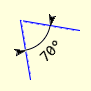
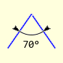
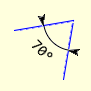
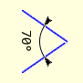
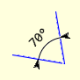
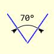
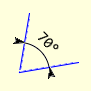
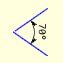
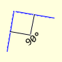
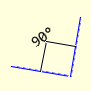

==================
Arc AA Dimension
==================

..

    +--------------+---------------+--------------+---------------+-----------------+
    |                      **Normal Angles**                      | **Right Angle** |
    +==============+===============+==============+===============+=================+
    |   |10_70|    |   |55_70|     |  |100_70|    |  |145_70|     |     |10_90|     |
    +--------------+---------------+--------------+---------------+-----------------+
    | First Sector | Second Sector | Third Sector | Fourth Sector |  First Sector   |
    +--------------+---------------+--------------+---------------+-----------------+
    |   |190_70|   |   |235_70|    |  |280_70|    |   |325_70|    |    |190_90|     |
    +--------------+---------------+--------------+---------------+-----------------+
    | Fifth Sector | Sixth Sector  |Seventh Sector| Eighth Sector |  Fifth Sector   |
    +--------------+---------------+--------------+---------------+-----------------+

Arc AA Dimension Properties 
-----------------------------

.. raw:: html

   

   
<a>Show/Hide <b>arc_dim_aa</b> Attributes</a>

PIL has a separate arc method with the following properties.

* xy
    Four points to define the bounding box. Sequence of [(x0, y0), (x1, y1)] 
    or [x0, y0, x1, y1].
* start
    Starting angle, in degrees
* end   
    Ending angle, in degrees.
* fill
    Arc colour

The arc dimension requires the following additional attributes.

* im 
    PIL image handle, link to the calling program
* dr
    PIL drawing handle, link to the calling program
* centre
    Arc's circle centre
* radius
    Arc's circle radius
* begin
    Starting angle, in degrees
* end   
    Ending angle, in degrees.
* fill
    Arc colour, RGB tuple    
* text
    Text to be written next to the dimension
* font
    Font of the text
* arrowhead
    Three integer tuple describing the shape and size of the arrow
* back
    background colour, RGB tuple

.. raw:: html

   

|

Create Arc AA Dimension
--------------------------

The arcs used for dimensions are based on circles rather than ellipses, so
use the arc centre, its radius and the start and end angles, rather than the
box surrounding the circle containing the arc.

The arc dimension shows the angle directly, so no extenders are required, 
add the text straightaway. Use the PIL image reference, centre, radius,
begin and end angles, followed by the text and its font
and finally the arrow shape. 

Once we have extracted the values from the tuples,  
calculate the coordinates of the start and end positions. Whether the
arrows need to be inward or outward pointing depends on the arc size and is
made automatically.
Lastly position the text according to the text and arc sizes.

Add a conditional statement to draw a right angle 
square lines for 90° instead of an arc. If 
the angle becomes a straight line raise an error.

The utility function polar2cart from :ref:`DimLinesPIL<p2c>` is particularly 
useful.

.. container:: toggle

    .. container:: header

        *Show/Hide Code* test_angle_aa_dim.py

    .. literalinclude:: ../examples/aadims/test_arc_aa_dim.py