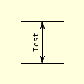
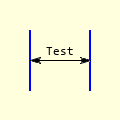

==================
Inner AA Dimension
==================

..

    +------------+----------+
    |  **Inner Dimensions** |     
    +============+==========+
    |   |hor|    |  |vert|  |
    +------------+----------+
    | Horizontal | Vertical |
    +------------+----------+

Inner AA Dimension Attributes
-----------------------------

This is similar to the LineAA dimension, except that text and font have been 
added and angle is no longer necessary.

.. raw:: html

   

   
<a>Show/Hide <b>inner_dim_aa</b> properties</a>

* im 
    PIL image handle, link to the calling program
* dr 
    PIL draw handle, link to the calling program
* ptA
    Start coordinates
* ptB 
    Finishing coordinates 
* text
    Text to be written next to the dimension
* font
    Font of the text
* fill
    Line colour, as an RGB tuple 
* arrowhead
    Three integer tuple describing the shape and size of the arrow
* arrow
    position of the arrow on the line, which influences the direction it 
    points.
* back
    Background colour, as an RGB tuple    

.. raw:: html

   

|

Normally inner dimensions are not slanted. The position of the 
text changes according to orientation, so still use angled_text. 

.. container:: toggle

    .. container:: header

        *Show/Hide Code* test_inner_aa_dim.py

    .. literalinclude:: ../examples/aadims/test_inner_aa_dim.py
