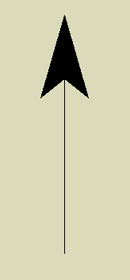
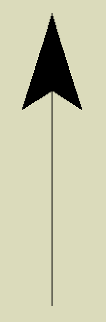
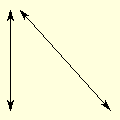
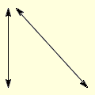

===================================
Introduction Antialiased Dimensions
===================================

..

    +---------+---------+
    | **Drawn Arrows**  |
    +=========+=========+
    | |pil|   | |can|   |
    +---------+---------+
    |  PIL    | canvas  |
    +---------+---------+

Large arrows with vertical lines, compare that made using the PIL dimensions 
and tkinter canvas.
Now compare the images below.

    +------------+--------------+
    |   **Drawn Arrows**        |
    +============+==============+
    | |dim|      | |aadim|      |
    +------------+--------------+
    | normal PIL | antialiased  |
    +------------+--------------+

The lines and arrows were created by PIL using the standard utilities
developed here 
on the left and antialiased on the right. The left diagonal line  
looks jagged and paler than the vertical line, the right diagonal line looks
about the same darkness as its companion vertical line. It is difficult to
see much difference between the various arrows, but the vertical arrows
look jagged.

If the components of a dimension are shown at large size or the lines are
mainly orthogonal then the need for antialiasing falls away, but generally
antialiasing gives a better look to the final image. Since we are using
PIL throughout it is possible to mix and match.

The comments for the :ref:`orthogonal dimensions<introdims>` apply.

#. Adding arrows to an antialiased line
    The arrows are antialiased.

#. Dashed antialiased line
    Used on lines 1 pixel wide, as wider lines require that the width is not
    larger than the dash length.

#. Angled text
    No change required

Since colour for the antialiasing changes, ensure that the component and  
background colours (fill and back) are both  RGB tuples. 

The dimension examples used the module DimLinesPIL, the 
antialiasing dimension examples have a similar module DimLinesAA. This 
will be largely self contained but will refer back to original module for 
functions such as angled text. The antialiasing functions have similar names 
to the dimension functions, except for the _aa tag, 
so dims.py becomes dims_aa.py.