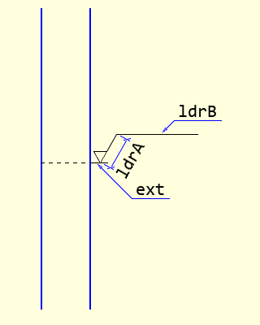
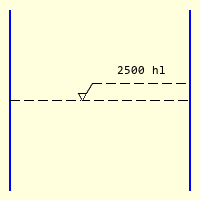
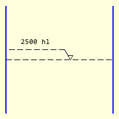
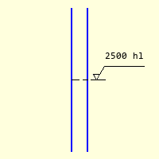
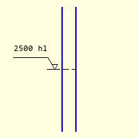

===================
Level AA Dimensions
===================

Inner and Outer Levels
======================

.. _props-aa-level:

    Outer Level dimension attributes

..

AA Level Properties
-------------------

.. raw:: html

   

   
<a>Show/Hide <b>level_dim_aa</b> Attributes</a>

# im 
    PIL image handle, link to the calling program
# dr
    PIL image handle, link to the calling program
# at
    Coordinates at left tank wall level
# diam    
    Tank diameter, pixels
# ext
    Tuple of extender length and gap, default 0 (internal dimension),
    enlarge the gap with very thick tank walls
# ldrA
    Inclined leader length, default 20, if negative the dimension is switched
    around
# ldrA
    Horizontal leader length, default 20
# dash    
    Tuple giving dash pattern, dash length then gap default (10, 4)
# text
    Dimension text
# fill
    Dimension colour, RGB tuple
# back
    background colour, RGB tuple
# tri
    Level indicator, equilateral triangle default 8
# font
    Font of the text, default None

.. raw:: html

   

|

    
    Level dimension inside a tank

    
    Level dimension negative leader

    
    Outer level dimension

    
    Negative outer level dimension

|

Contents of a tank are shown with dashed line and dashed leaders. Apart from
the starting position, diameter of tank, the user can choose different dash
patterns, the lengths of the inclined and horizontal leader, the length of the
extender on outer dimensions and the indicating triangle size. Normally the
leader lies to the right of the vessel, if a
negative value (``ldrA``) is used the leader is on the lefthand side. As the 
dashed lines will be antialiased the method used in the plain dimensions was
:ref:`changed<dash-bres>`. If the extender ``ext`` is 0 then an inner 
dimension is shown.

.. container:: toggle

    .. container:: header

        *Show/Hide Code* test_level_aa_dim.py

    .. literalinclude:: ../examples/aadims/test_level_aa_dim.py

If the normal level dimension cannot be used then an outside dimension can
be used. This has an extension line outside of the vessel, the indicating 
triangle sits on the extension line. As the leaders are outside of the vessel
they are drawn solidly.

The extender ``ext`` can be a single integer, in which case the line touches
the vessel or as a tuple of two values, the first being the line length, the
second the gap length.