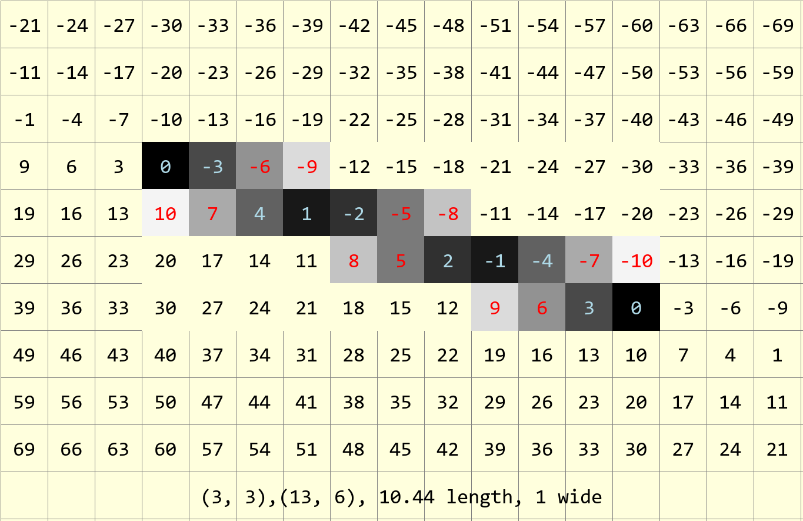
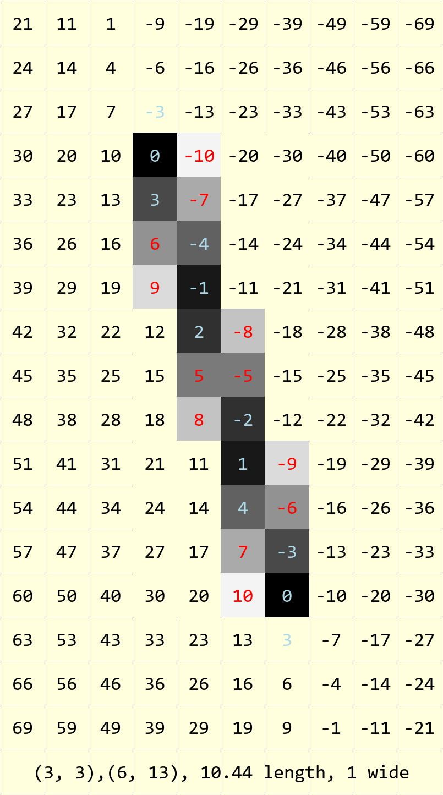

=================
AA Line Dimension
=================

.. figure:: ../figures/aadims/dimension_2_aa_arrows.png
    :width: 120
    :height: 120  

    Dimension_aa can draw an inclined line with arrows at both or only one
    end. 

The first function ``dimension_aa`` can be used to draw a line with arrows 
at one or both ends, alternatively if only the start coordinates and angle
are given it can attach an arrow to the end of a line or arc. Use the two 
attributes ``arrow`` and ``arrowshape`` to 
define the arrow(s), just as in tkinter.

AA Dimension Attributes
-----------------------

.. raw:: html

   

   
<a>Show/Hide <b>dimension_aa</b> AA Line Dimension</a>

The PIL line has 3 documented attributes

* xy
    Sequence of 2 tuples like  [(x, y), (x, y), ...] or numeric values like 
    [x, y, x, y, ...].
* fill
    Line colour, as an RGB tuple
* width
    Line width in pixels

dimension_aa is similar to line, with the following changes

* im
    PIL image handle, linked to calling program
* dr 
    PIL draw handle, link to the calling program
* ptA
    Start coordinates
* ptB 
    Finishing line coordinates, optional
* angle
    Angle in degrees, optional    
* arrowhead
    Three integer tuple describing the shape and size of the arrow
* arrow
    position of the arrow on the line, which influences the direction it 
    points.
* back
    Background colour, as an RGB tuple
    
Width has been removed.

.. raw:: html

   

|

AA Arrow and Arrowshape Attributes
----------------------------------

**arrow** has three options "first", "last" and "both" which
positions the arrow relative to the line ends.

**arrowshape** is a tuple
of three figures, the first d1 shows the length down the line covered by the 
arrow (AC), the second d2 is the length between the point and trailing tips
(AF) and lastly the perpendicular distance d3 between the shaft and the 
trailing tips (EF). The default value (8, 10, 3) is not a right angled 
triangle but produces a shape like that of a swift's tail. 

Create dimension_aa Script
--------------------------

Since the PIL polygon only applies to normal shapes with no antialiasing we 
need to make our own arrow. Use a modified antialiased line with only one 
side having antialiased pixels, floodfill the inside with the required 
colour. There are some new functions and the line function requires some 
modification
to plot the required antialias pixels. 

As before with DimLinesPIL the user interacts with dimension, but this time 
``dimension_aa``.
The only external changes are that when calling we include the PIL ``image``
handle for flood fill, and we have an optional element ``back`` for
antialiasing.

dimension_aa is very similar to the original script, except that the 
connecting line is
shortened so that it does not overwrite the arrows.

.. raw:: html

   

   
<a>Show/Hide <b>dimension_aa</b> change connecting line</a>

::

    if angle is None and ptB:
        x1, y1 = ptB
        phi = atan2(y1-y0, x1-x0)

        if arrow in ('first', 'both'):
            cx0 = int_up(x0 + d1 * cos(phi))
            cy0 = int_up(y0 + d1 * sin(phi))
        else:
            cx0, cy0 = ptA
        if arrow in ('last', 'both'):
            cx1 = int_up(x1 - d1 * cos(phi))
            cy1 = int_up(y1 - d1 * sin(phi))
        else:
            cx1, cy1 = ptB

        plotLineAA(dr, (cx0, cy0), (cx1, cy1), back=(255,255,221), fill=fill)

.. raw:: html

   

|

then call the antialiased polygon, as the lengths along the arrow shaft have
already been calculated these are not required again. When calculating the
arrow polygon points ensure that they are integers. 

Generally ``polyAA`` is hidden from the user, but can be used if needed,
but may require support functions. If required, the list of polygon points 
is first converted to a 2D list, this follows the allowable
PIL polygon options. The polygon centroid is found, this point, in conjunction 
with the lines making the polygon sides, tell us the orientation of 
the sides, which in turn shows on which side the antialiasing is required. A 
loop is used to plot almost all of the sides, except for the last side which
is plotted separately. The order of plotting the long lines is important, 
seen already when drawing widget arrows,
`Simple Arrows <https://tkinterttkstyle.readthedocs.io/en/latest/08down_to_earth.html>`_

.. raw:: html

   

   
<a>Show/Hide <b>AA Polygon</b> and support functions</a>

::

    def to_matrix(l,n):
        # convert list to multidimensional list
        return [l[i:i+n] for i in range(0, len(l), n)]
    
    def above_below(pta,ptb,ptc):
        x1, y1 = pta
        x2, y2 = ptb
        xA, yA = ptc
        # line [(x1,y1),(x2,y2)],point (xA,xB) is point one side or other
        v1 = (x2-x1, y2-y1)   # Vector 1
        v2 = (x2-xA, y2-yA)   # Vector 1
        xp = v1[0]*v2[1] - v1[1]*v2[0]  # Cross product

    def centroid(points):
        # assume that points is a 2D list of points polygon
        x = [p[0] for p in points]
        y = [p[1] for p in points]
        centroid = int_up(sum(x) / len(points)), int_up(sum(y) / len(points))
        return centroid

    def flood(im, dr, x, y, fill, back):
        xy = x,y
        if im.getpixel(xy) == back:
            dr.point((x,y), fill)

            flood(im, dr, x+1,y, fill, back)
            flood(im, dr, x,y+1, fill, back)
            flood(im, dr, x-1,y, fill, back)
            flood(im, dr, x,y-1, fill, back)

    def polyAA(im, dr,xy,back=(255,255,221),fill=(0,0,0), outline=None):
    # xy list of consecutive points

        try:
            lpts = len(xy[0])
        except:
            lpts = 0

        if lpts ==0:
            xy = to_matrix(xy, 2)
        lxy = len(xy)
        cx, cy = centroid(xy)

        for ix in range(lxy):
            if ix > 0:
                cross = above_below(xy[ix-1],xy[ix],(cx,cy))
                plotLinePartAA(dr, xy[ix-1], xy[ix], back=(255,255,221),fill=fill,cross=cross)
                
        cross = above_below(xy[0],xy[lxy-1],(cx,cy))
        plotLinePartAA(dr, xy[0], xy[lxy-1], back=(255,255,221),fill=fill,cross=cross)
        if isinstance(outline,tuple) is False:
            flood(im, dr, cx, cy, fill, back)

.. raw:: html

   

|

polyAA calls a specialised single pixel wide antialiased line ``PartLineAA``
which in conjunction with the functions **findSect** and **above_below** 
determines which side of
the line should be antialiased or not. When drawing an antialiased polygon
it is best to turn off the inner antialiasing when creating the outside 
border. This helps ensure that there are no light pixels on the inside before
flood filling. Even when making unfilled polygons it can help to prevent
the corners being obscured by antialiasing. 

As already :ref:`explained<zigl-line>` the Zigl algorithm is not totally
accurate, so when
one side of the antialiasing is switched off it is better to use a corrected
version, resulting in fewer stray light pixels. Essentially the line  
follows the pattern of the corrected Zigl line with flipped coordinates. Let 
the algorithm plot as normal then add the anialiasing just after the main
line plot. The main line plotting changes colour intensity according to the
errors/differences at that point.

.. raw:: html

   

   
<a>Show/Hide <b>plotLinePartAA</b> customised line </a>

::

    def PartLineAA(draw, pta, ptb, fill=(0,0,0), back=(255,255,221), cross=0):
        x0, y0 = pta
        x1, y1 = ptb
        sects = findSect(pta, ptb)

        dx = dx0 = abs(x1 - x0)
        dy = dy0 = abs(y1 - y0)
        sx = 1 if x0 < x1 else -1
        sy = 1 if y0 < y1 else -1

        if dx0 > dy0:       # gentle incline
            dy = -dy
            dr = dx0 + 1
        else:               # steep slope
            dx = -dx
            dr = dy0 + 1
            dx, dy = dy, dx
            
        err = dx + dy
        ed = 1 if err == 0 else sqrt(dx*dx+dy*dy)

        def errs(comp, size,j):
            return 255 if comp == 255 else int((255-comp) * j / size) + comp

        diffs = defaultdict(list)
        diffs = defaultdict(lambda:back, diffs)
        for i in range(int(ed)+1):
            if fill == (0,0,0):
                diffs[i] = tuple(int(255*i/ed) for k in range(3))
            else:
                diffs[i] = tuple(errs(fill[k],ed,i) for k in range(3))

        for j in range (dr):        # main loop
            ez = err-dx-dy
            out = abs(ez)
            draw.point([x0, y0], fill=diffs[out])
            if abs(ez+dx) < ed-1:
                out = abs(ez+dx)
                if dx0 > dy0:
                    if cross < 0 and sects[0] in (4,8) or \
                        cross > 0 and sects[0] in (5,1): 
                        draw.point([x0,y0+sy], fill=diffs[out]) 
                else:
                    if cross < 0 and sects[0] in (2,6) or \
                        cross > 0 and sects[0] in (3,7): 
                        draw.point([x0+sx,y0], fill=diffs[out])

            if abs(ez-dx) < ed-1:
                out = abs(ez-dx)
                if dx0 > dy0:
                    if cross < 0 and sects[0] in (1,5) or \
                        cross > 0 and sects[0] in (8,4):
                        draw.point([x0,y0-sy], fill=diffs[out])
                else:
                    if cross < 0 and sects[0] in (3,7) or \
                        cross > 0 and sects[0] in (6,2):
                        draw.point([x0-sx,y0], fill=diffs[out])

            e2 = err<<1
            if e2 >= dy:
                err += dy
                if dx0 > dy0:
                    x0 += sx
                else:
                    y0 += sy
            if e2 <= dx:
                err += dx
                if dx0 > dy0:
                    y0 += sy
                else:
                    x0 += sx

.. raw:: html

   

|

Flood has been limited to moving around along the main axes, otherwise it
might not be contained on an inclined arrow.

Use the normal antialiased line which looks correct and is 
essentially the same as already developed.

.. raw:: html

   

   
<a>Show/Hide <b>LineAA</b> standard line </a>

::

    def LineAA(draw, pta, ptb, fill=(0,0,0), back=(255,255,255))
        # draw a dark anti-aliased line on light background
        x0, y0 = pta
        x1, y1 = ptb
        dx = abs(x1 - x0)
        dy = abs(y1 - y0)
        sx = 1 if x0 < x1 else -1
        sy = 1 if y0 < y1 else -1
        err = dx - dy   # error value e_xy
        
        ed = dx + dy

        ed = 1 if ed == 0 else sqrt(dx*dx+dy*dy)
        dr = dx + 1 if dx > dy else dy + 1 # better plotting when steep
        
        def errs(comp, size,j):
            return 255 if comp == 255 else int((255-comp) * j / size) + comp

        diffs = defaultdict(list)
        diffs = defaultdict(lambda:back, diffs)
        for i in range(int(ed)+1):
            if fill == (0,0,0):
                diffs[i] = tuple(int(255*i/ed) for j in range(3))
            else:
                diffs[i] = tuple(errs(fill[j],ed,i) for j in range(3))
                
        for x in range (dr):  # pixel loop
            draw.point([x0, y0], fill=diffs[abs(err-dx+dy)])
            e2 = err
            x2 = x0
            if e2<<1 >= -dx:                # y-step
                if e2+dy < ed and x < dr - 1:
                    draw.point([x0,y0+sy], fill=diffs[abs(e2+dy)])
                err -= dy
                x0 += sx
            if e2<<1 <= dy and x < dr - 1:  # x-step
                if dx-e2 < ed:
                    draw.point([x2+sx,y0], diffs[abs(dx-e2)])
                err += dx
                y0 += sy

.. raw:: html

   

|

    
    Shallow antialiased line, antialiasing values are mirrored with opposite
    signs. 
    
    This figure was made directly from the antialiasing difference values 
    without using any algorithm.

    
    Steep antialiased line, as before, antialiasing values are mirrored with 
    opposite signs. 

When checking the antialiasing note that the Zigl algorithm
places the antialiasing on one side of the line with a change in the larger
coordinate and antialiasing on the opposite side with the smaller coordinate.
On lines close to 45° this works well. For shallower or steeper lines there 
is an imbalance of antialiasing which becomes most apparent in situations
when only one side of antialiasing is used.

