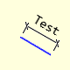
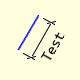
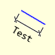
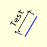

=====================
Slanting AA Dimension
=====================

..

    
    +----------------+-----------------+-----------------+-----------------+
    |                       **Slanting Dimensions**                        |
    +================+=================+=================+=================+
    |  |30|          |  |120|          |  |210|          |  |300|          |
    +----------------+-----------------+-----------------+-----------------+
    | Sloping at 30° | Sloping at 120° | Sloping at 210° | sloping at 300° |
    +----------------+-----------------+-----------------+-----------------+

Slanting AA Dimension Properties
--------------------------------

.. raw:: html

   

   
<a>Show/Hide <b>slant_dim_aa</b> Attributes</a>

# im 
    PIL image handle, link to the calling program
# dr
    PIL drawing handle, link to the calling program
# ptA
    Start coordinates
# ptB 
    Finishing coordinates, optional
# extA
    Two integer tuple, giving the extension line size and gap next to start
# angle
    Slope of dimension, optional
# length
    Dimension length, optional
# text
    Dimension text
# font
    Font of the text
# fill
    Line colour, RGB tuple
# back
    Background colour, RGB tuple
# tail
    Show tails or arrows, default **True**
# arrowhead
    Three integer tuple describing the shape and size of the arrow, default
    (10,8,3)
# arrow
    position of the arrow on the line, which influences the direction it 
    points, default **both**

.. raw:: html

   

|

This dimension is set parallel to the slanting surface, with extensions  
perpendicular to the dimension. The text is set outside of the dimension with 
attention paid to the text orientation. Use either 45° short stubs or arrows. 
When using these dimensions remember that the starting
position refers to the item.

In essence apart from the complication of the angled geometry, it follows 
much the same pattern as the outer dimension. Specify the dimension position 
by giving two coordinates on the object, ptA and ptB, at a perpendicular 
distance
of the extension, extA, alternatively give the start position and angle with
dimension length. It is assumed that both extensions are of equal size.

If the text lies on the wrong side of the object simply change the angle by 
180°.

.. container:: toggle

    .. container:: header

        *Show/Hide Code* test_slant_aa_dim.py

    .. literalinclude:: ../examples/aadims/test_slant_aa_dim.py

