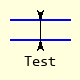
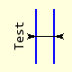
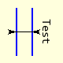

======================
Thickness AA Dimension
======================

.. |above| image:: ../figures/dims/thick_dim_90.png
    :width: 80
    :height: 80

..

    +---------------+-----------------+--------------+---------------+
    |  .. centered:: **Thickness Dimensions**                        |
    +===============+=================+==============+===============+
    |  |left|       |  |right|        |  |above|     |  |below|      |
    +---------------+-----------------+--------------+---------------+
    | horizontal 0° | horizontal 180° | vertical 90° | vertical 270° |
    +---------------+-----------------+--------------+---------------+

Properties Thickness AA Dimension
---------------------------------

The properties are similar to the inner dimension, but the thickness and 
angle have now been 
added and the finishing point removed.

.. raw:: html

   

   
<a>Show/Hide <b>thickness_dim_aa</b> Attributes</a>

# im 
    PIL image handle, link to the calling program
# ptA
    Start coordinates
# thick 
    Thickness of item
# angle
    Slope of Dimension, changes text position, default horizontal 0°
# text
    Text to be written next to the dimension
# font
    Font of the text
# fill
    Line colour, RGB tuple
# arrowhead
    Three integer tuple describing the shape and size of the arrow
# arrow
    position of the arrow on the line, which influences the direction it 
    points.
# back
        Background colour, RGB tuple

.. raw:: html

   

|

The thickness dimension draws a small line between the inner and outer 
surfaces, two inward pointing arrows are added to the ends of the connecting 
line. 
Text is added that lies along the outer surface, dimension_aa provides the 
arrows.

If the distance between the surfaces is large then use the inner 
dimension and the arrows then point outwards. 

.. container:: toggle

    .. container:: header

        *Show/Hide Code* test_thick_aa_dim.py

    .. literalinclude:: ../examples/aadims/test_thick_aa_dim.py