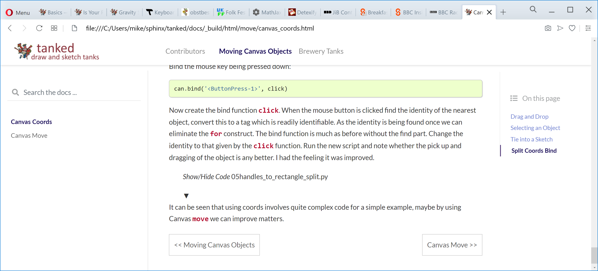

.. _authors:

============
Contributors
============

Edgar Donk, but mainly all those people working on python and Sphinx, 
without whom this would not have been possible.

=======
Contact
=======

Any suggestions or comments please forward to 

edga.donk@gmx.de

Just to anticipate what you are probably thinking - I know it's much too 
long.

Repository
==========

You should find all the python examples and their widget images here.

`PIL-dimensions <https://github.com/Edgar-Donk/PIL-dimensions>`_

Read the Docs
=============

Where you'll find the explanations.

`Read the Docs <https://pil-dimensions.readthedocs.io/en/latest/>`_

Navigation
==========

    Example page showing navigation aids

This sphinx module has been created by the PyData Sphinx Team. 

.. raw:: html

   

   
<a>Show/Hide <b>Navigation</b> on the webpage</a>

Home
----

In the upper left hand corner is an icon and logo, click on this and you will
be in the home or start page. From here navigate to the website sections.
In our image a sea captain and ``dimension``.

Chapters
--------

Across the top of the page are the various chapters of the site, click on one 
of these and land on the chapter index page, normally with a brief 
description and links to the various chapters or pages. The current chapter
is highlighed in bold. In our image ``Moving Canvas Objects``.

Pages
--------

On the left hand are the various pages of this chapter. The current 
page is in bold. Click on any one of these to go to the relevant page.
In our image ``Canvas Coords`` is the current page.

Sections
--------

A page may be subdivided into sections, which are to be found on the right
hand side. The current section is shown in bold and a vertical line also
indicates this section. Click on any one of the sections to go there. In our
image ``Split Coords Bind`` is the current section.

Previous and Next
-----------------

At the bottom of the page are two navigation boxes that take you to the
previous and next page, shown with their page names, rather than just
previous and next. In our image previous is ``Moving Canvas Objects`` and 
next is ``Canvas Move``.

.. raw:: html

   

More
====

.. hint:: Try flying the carpet - it's magic afterall!

|

.. raw:: html

    <head>
      <link rel="stylesheet" href="_static/night.css">
    </head>
    

      

        

        

        

        

        
 
          

        

          <figcaption class="capt">
            Click on one of the images below to get whisked away 
            on the magic carpet of the Internet
          </figcaption>  
      

    

|

Thanks to `Sobhan Dash <https://dev.to/sobhandash/lets-build-a-night-sky-using-pure-scss-2g0n>`_
for the night sky.

Some of the trickier parts of tkinter.ttk
-----------------------------------------

.. _froth: https://frothy-brew.readthedocs.io/en/latest/index.html

From ttk.notebook to ttk.scale, with canvas move and create a colour picker.

Styling with tkinter.ttk
------------------------

.. _style: https://tkinterttkstyle.readthedocs.io/en/latest/index.html

Creating your own theme using Style.

Linking Python to Arduino
-------------------------

.. _ard: https://electronic-python.readthedocs.io/en/latest/index.html

.. image:: _static/arduino.png
   :width: 572
   :height: 104
   :target: ard_
   :class: only-light

Basics and working with VPython, then create a digital gauge.

Water Properties
----------------

.. _ale: https://adams-ale.readthedocs.io/en/latest/index.html

.. image:: _static/ben_ale.png
   :width: 533
   :height: 104
   :target: ale_
   :class: only-light

.. image:: _static/ben_aleneon.png
   :width: 533
   :height: 104
   :target: ale_
   :class: only-dark

Simplified but accurate water properties with interactive altair plots.

Iterative Solutions
-------------------

.. _imps: https://pesky-imps.readthedocs.io/en/latest/index.html

Iterative methods used for interpolation, extrapolation, root finding and 
equation optimisation, many of the methods are similar.

Dataframe
---------

.. _framed: https://frameyourdata.readthedocs.io/en/latest/index.html

.. image:: _static/ben_framed.png
   :width: 653
   :height: 104
   :target: framed_
   :class: only-light

.. image:: _static/ben_framedneon.png
   :width: 653
   :height: 104
   :target: framed_
   :class: only-dark

Load data, change the names and the layout (wide or long format), clean, save 
and visualise the data.