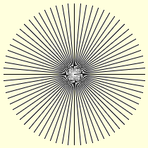
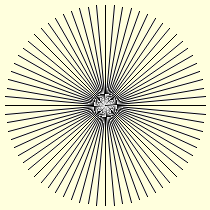
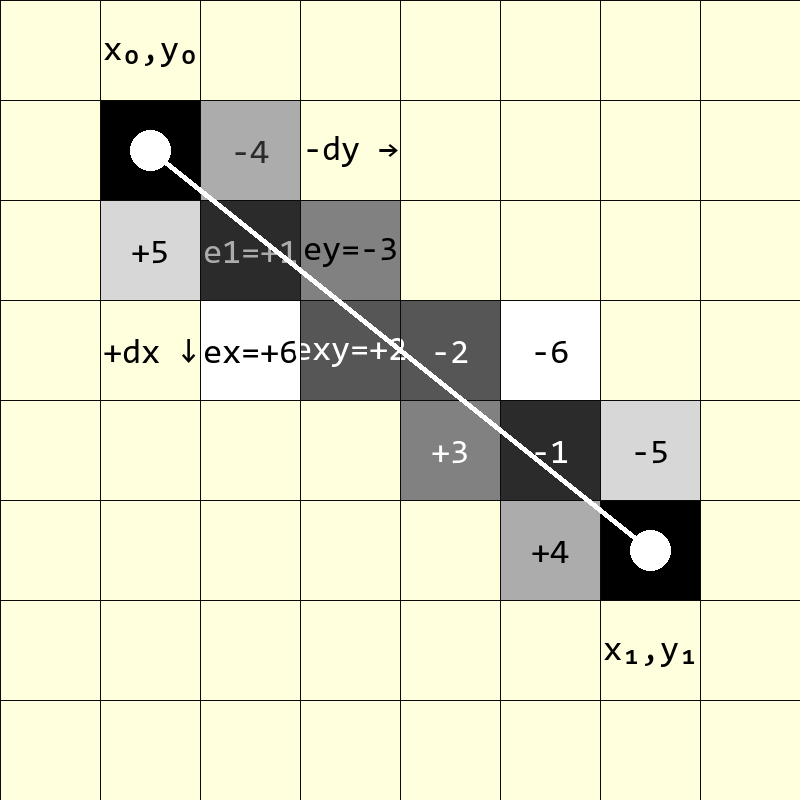
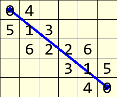
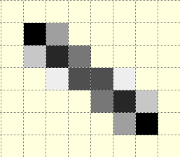
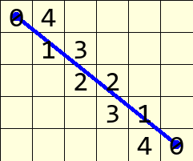

=======================
Pro-Active Antialiasing
=======================

   
   Alois Zigl's algorithm, in all octants
   
   The 45° lines have antialiasing

   
   Modified Alois Zigl's algorithm, in all octants
   
   The 45° lines have **no** antialiasing

Look closely at the output of the antialiased lines, all the lines were drawn 
at regular 5° intervals and there is no :ref:`anomoly <tan>` close to the 
main axes seen previously.

To date the method of antialiasing had been based on drawing larger than
required then bringing the drawing back to the correct size with a resampling
filter. The advantage of this method is that it involves standard PIL methods
and is straightforward. The results are reasonable enough to use, but some 
errors can creep in, which are difficult to rectify.

As we saw with Alois Zigle's algorithm we obtain the values of the errors 
between the theoretical line position and the pixels activated to represent
the line on the monitor.

   
   Line drawn from (x0, y0) to (x1, y1) showing the pixels required for
   antialiasing.
   
   :ref:`The line is the same as the previous example <zigl>`. Any pixel with 
   an absolute value of 6 or less will be coloured.

   
   Antialias values from rasterization algorithm
   
   Pixel colour depends on the absolute value

When working with Alois' antialiasing algorithm the error values of pixels 
are required both sides of the theoretical line. Integer values are given to 
the distance of the pixel away from the theoretical line, 
higher integers being further away from the line than lower values.

Take the example and extend the
error values to include ones used for antialiasing. Alois has used the 
diagonal pixels immediately after line pixel position. At the starting pixel
(x0, y0) two pixelsL are used for antialiasing, the first pixel one in the
x-direction (x0+1, y0), the second in the y-direction (x0, y0+1). These two 
pixels sit diagonally on either side of the line just after the start pixel. 
Repeat this down the line until the endpoint.

   Alois Zigl's antialiased line

Look where the original pixel line is drawn, without antialiasing the line
pixels would all have been black, but with antialiasing the line becomes
lighter but still remains darker than the antialiasing pixels. 

If the criterion for deciding which pixels should 
be coloured for antialiasing is changed, we might opt for a vertical or 
horizontal distance of one
pixel, in this case only those pixels that clipped the theoretical line are
chosen, and those pixels with an error less than 5 would have been chosen, 
eliminating those with a value of 5, 6 or 7. 

   
   Antialias values similar to Wu's algorithm
   
   Fewer pixels, but those that remain are unaltered

Apart from the two end pixels, 
the other pixels have one antialias partner, in the example the pair of pixel 
absolute values add up to 5. In principle, except for the end conditions, this  
looks similar to `Xiaolin Wu's algorithm <https://web.archive.org/web/20160408133525/http://freespace.virgin.net/hugo.elias/graphics/x_wuline.htm>`_.

.. _aaline:

Once the simple line was sorted out the antialiased lines were not too 
difficult to program. The main difference between the original and modified 
output was at
45° where the standard Alois' algorithm gave additional antialiasing pixels
and the modified algorithm (like Wu's algorithm) had no antialiasing pixels.
This algorithm is far simpler than Xiaolin Wu's algorithm, with only the 
antialiasing colouring requiring floating point arithmetic.

.. raw:: html

   

   
<a>Show/Hide <b> Antialiased Line </b> One Pixel Wide  </a>

.. code-block:: python
   :emphasize-lines: 13

   def plotLineAA(draw, pta, ptb, fill='black'):
    # draw a black (0) anti-aliased line on white (255) background
    x0, y0 = pta
    x1, y1 = ptb
    dx = abs(x1 - x0)
    dy = abs(y1 - y0)
    sx = 1 if x0 < x1 else -1
    sy = 1 if y0 < y1 else -1
    err = dx - dy                            # error value e_xy

    ed = dx + dy

    ed = 1 if ed == 0 else sqrt(dx*dx+dy*dy) # max(dx, dy) #
    dr = dx + 1 if dx > dy else dy + 1      # better plotting when steep

    for x in range (dr):                    # pixel loop
        hue = int(255*abs(err-dx+dy)/ed)
        draw.point([x0, y0], fill=(hue, hue, hue))
        e2 = err
        x2 = x0
        if e2<<1 >= -dx:                    # y-step
            if e2+dy < ed and x < dr - 1:
                hue = int(255*(e2+dy)/ed)
                draw.point([x0,y0+sy], fill=(hue, hue, hue))
            err -= dy
            x0 += sx
        if e2<<1 <= dy and x < dr - 1:      # x-step
            if dx-e2 < ed:
                hue = int(255*(dx-e2)/ed)
                draw.point([x2+sx,y0], fill=(hue, hue, hue))

            err += dx
            y0 += sy

.. raw:: html

   

|

To obtain an antialiased line that is similar to Wu's algorithm, change the 
highlighted line from::

   ed = 1 if ed == 0 else sqrt(dx*dx+dy*dy)

to::

   ed = 1 if ed == 0 else max(dx, dy)

Notice the similarity to :ref:`the straight line <code-zigl>` algorithm.

