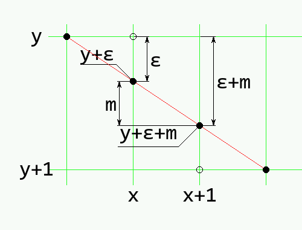

===================
Bresenham Algorithm
===================

Usually computer input comes in as a continuous function,
such as a line, but it is represented on the monitor or printer as many 
pixels of light or dots of ink. The pixels or dots are in a 
rectangular grid, so close as not to be noticed. The process of changing 
a continuous function to one that displays on a rectangular grid is called
rasterization.

.. note:: Line Errors

   Most texts treat the difference between the pixel and theoretical line or 
   circle as an error. This is IMO a poor nomenclature as an error implies 
   that there is a better solution. In most of these examples this is not 
   the case. For this reason it may help to think of `difference` rather 
   than `error`.

One well known rasterization process is the 
`Bresenham algorithm <https://www.cs.helsinki.fi/group/goa/mallinnus/lines/bresenh.html>`_ 
used when drawing lines, where the 
program decides which pixels or dots should be coloured. The 
algorithm works in the first half of the first quadrant, that is 
between 0 and 45 degrees, (gradient between 0 and 1).

Because the gradient is between 0 and 1 the x-value at the end point is 
larger than 
the x-value at the start point. 

.. math::

      x_{1} > x_{0}

Secondly the gradient constraint ensures that the change in x-values is 
greater than the change in y-values.

.. math::

      x_{1} - x_{0} > y_{1} - y_{0}

The cleverness of the algorithm is that it uses only integer maths, with no
divisions and only a multiplication of 2, otherwise just addition and 
subtraction with a bit of comparison. This speeds up the computation.

It follows these simple rules::

   A = 2 × change in Y value
   B = A - 2 × change in X value
   P = A - change in X value
   
   if P is less than zero move one pixel in the x-direction, add B to P
   if P is zero or more move diagonally one pixel, add A to P 

The algorithm decides which pixel to activate as it progresses along the 
line. As the algorithm moves along the line the 
x-pixel always increments. This means that
there are only 2 activation options next to the current pixel, one in the 
x-direction (x+1, y), the other in the diagonal direction (x+1, y+1),  
the y-direction can only increment with a diagonal pixel.

Usually the 
algorithm chooses the best fit rather than an exact fit of the pixel 
to the line. 

   
   Drawing a line on a raster grid.
   
   In this example the pixel (x, y) is activated, the next pixel to
   be activated lies at (x+1, y+1). The gradient is m and ε is the y-ordinate 
   error. (The figure has been changed from the original, so that y increases 
   down the page).

.. sidebar:: Pixel Coordinates

   Most textbooks treat the pixel on the coordinate intercept, however when
   using an image editor the pixel is shown in the centre of a square, so 
   point 0,0 is the middle of the square in the upper left corner. 

In effect the choice lies between
which of the two y values is closer, y or y+1 at the new x value of x+1.

The plotted point (x, y) is 
usually in error by an amount ε from the mathematically correct plot. The
mathematical plot is at (x, y+ε). This error can range from -0.5 to +0.5. In 
moving from x to x+1 the value of the mathematical y-ordinate would be 
y+ε+m. Choose the next coordinate as (x+1, y) if the difference between the 
new value and y is less than 0.5.

.. math::

      y + \epsilon + m < y + 0.5

Otherwise plot (x+1, y+1). This minimises the total error between the 
mathematical line and what is displayed. The error resulting from 
this new point can now be written back into ε which allows the process to
repeat for the next point at x+1. The new error can have one of two values, 
depending on which new point is plotted. If (x+1, y) is chosen, then the new
error is given by:

.. math::

      \epsilon_{new} \leftarrow (y + \epsilon + m) - y

otherwise:

.. math::

      \epsilon_{new} \leftarrow (y + \epsilon + m) - (y + 1)

This allows us to create an algorithm based on the error.

.. math::

      \begin{align}
      & \epsilon \leftarrow 0; \,  y \leftarrow y_{1} \\
      & for \, x \leftarrow \, x_{1} \, to \, x_{2} \, do \\
         & \quad Plot \, point \, at \, (x,y) \\ 
         & \quad if \, ( \epsilon + m < 0.5 ) \\ 
            & \qquad \epsilon \leftarrow \epsilon + m \\ 
         & \quad else \\
            & \qquad y \leftarrow y + 1, \, \epsilon \leftarrow \epsilon - 1 \\ 
         & \quad endif \\
      & endfor
      \end{align}

To eliminate the floating point numbers multiply the inequality after the 
plot throughout by Δx then by 2.

.. math::

     & \epsilon + m < 0.5 \\
     & \epsilon + \Delta{y}/\Delta{x} < 0.5 \\
     & 2 \epsilon \Delta{x} + 2 \Delta{y} < \Delta{x} 

Now the comparison only uses integers. 

Substitute ε' for ε Δx 

.. math:: 

   2(\epsilon' + \Delta{y}) < \Delta{x} 

The update rules for the error on each step may also be cast into the ε' form.

.. math::

      & \epsilon \leftarrow \epsilon + m \\
      & \epsilon \leftarrow \epsilon + m - 1

multiplying by Δx gives

.. math::

      & \epsilon \Delta{x} \leftarrow \epsilon \Delta{x} + \Delta{y} \\
      & \epsilon \Delta{x} \leftarrow \epsilon \Delta{x} + \Delta{y} - \Delta{x}

convert to ε' form

.. math::      
      
     & \epsilon' \leftarrow \epsilon' + \Delta{y} \\
     & \epsilon' \leftarrow \epsilon' + \Delta{y} - \Delta{x}

convert the algorithm

.. math::

      \begin{align}
      & \epsilon' \leftarrow 0;   y \leftarrow y_{1} \\
      & for \, x \leftarrow x_{1} \, to \, x_{2} \, do \\
         & \quad Plot \, point \, at \, (x,y) \\
         & \quad if \, ( \, 2 (\epsilon' + \Delta{y}) < \Delta{x} ) \\
            & \qquad \epsilon' \leftarrow \epsilon' + \Delta{y} \\
         & \quad else \\
            & \qquad y \leftarrow y + 1, \, \epsilon' \leftarrow \epsilon' - + \Delta{y}) < \Delta{x} \\
         & \quad endif \\
      & endfor 
      \end{align}

In order to draw lines in every situation, the algorithm is modified in such
a way that the calculation continues to work normally, by changing the start 
and end points and changing back as necessary. 

m > 1
   For a steep slope exchange all the x-values for y-values, and the old 
   y-values become x-values. After the calculation swop the values back 
   again.

x0 > x1
   If the start x-coordinate is higher than the end x-coordinates swop the
   start and end points.

m < 0
   Change the variables so as to make a positive gradient, so (x0, y0) 
   (x1, y1) is transformed to (x0, -y0) (x1, -y1) then after the algorithm 
   is calculated change the sign of all y-values.

As the changes are not totally exclusive it is found that just using the 
first and second will cover the third case.

The first script explicitly shows the changes that are required to operate 
in all 8 octants (2 octants make a quadrant)

.. raw:: html

   

   
<a>Show/Hide <b>Bresenham</b> First Variant </a>

::

   def bresenham(origin, dest, fill=(0,0,0)):
    result = []
    x0 = origin[0]; y0 = origin[1]
    x1 = dest[0]; y1 = dest[1]
    
    steep = abs(y1 - y0) > abs(x1 - x0)
    if steep:
        x0, y0 = y0, x0
        x1, y1 = y1, x1
        
    backward = x0 > x1
    if backward:
        x0, x1 = x1, x0
        y0, y1 = y1, y0

    dx = x1 - x0
    dy = abs(y1 - y0)
    error = dx / 2
    y = y0

    if y0 < y1: ystep = 1
    else: ystep = -1

    # the next few lines are the algorithm
    for x in range(x0, x1+1):
        if steep: result.append((y,x))
        else: result.append((x,y))
        error -= dy
        if error < 0:
            y += ystep
            error += dx
    # ensure the line extends from the starting point to the destination
    # and not vice-versa
    if backward: result.reverse()

    return result

.. raw:: html

   

|

The requirements for universality can easily be seen, however this script 
was not used.

.. sidebar:: Bitwise Operations
   
   To speed up the multiplication use a bit left shift operation, so when 
   there is a value multiplied by 2 convert to << 1::
   
      D = 2*dy - dx
      .....
         D -= 2*dx
      D += 2*dy
   
   becomes::
   
      D = (dy<<1) - dx
      ....
         D -= dx<<1
      D += dy<<1

.. _bres:

The following script was preferred

.. raw:: html

   

   
<a>Show/Hide <b>Bresenham</b> Second Variant </a>

::

   def bresenham(x0, y0, x1, y1):
    """Yield integer coordinates on the line from (x0, y0) to (x1, y1).
    Input coordinates should be integers.
    The result will contain both the start and the end point.
    """
    dx = x1 - x0
    dy = y1 - y0

    xsign = 1 if dx > 0 else -1
    ysign = 1 if dy > 0 else -1

    dx = abs(dx)
    dy = abs(dy)

    if dx > dy: # gentle slope
        xx, xy, yx, yy = xsign, 0, 0, ysign
    else:       # steep slope
        dx, dy = dy, dx
        xx, xy, yx, yy = 0, ysign, xsign, 0

    D = (dy<<1) - dx 
    y = 0

    for x in range(dx + 1):
        yield x0 + x*xx + y*yx, y0 + x*xy + y*yy
        if D >= 0:
            y += 1
            D -= dx<<1
        D += dy<<1

.. raw:: html

   

|

Only the steep slope situation was explicitly scripted, the backward slope
was incorporated into additional variables. The change of the 
multiplication to a bitwise function was straightforward. 

Both these scripts can be changed to point plotting. In the first case  
wherever the script appends to a list plot a point, also the final
condition for backward and reversal becomes irrelevant. With the second 
script the yield statement is replaced by a point plot using the given 
coordinates.