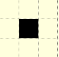

=======
Circles
=======

Mid-Point Algorithm
===================

   
   Circle radius 5 using mid point algorithm
   
   Start at the bottom (red), then progress by increasing x and sometimes 
   decrease y. There is some duplication of points, shown by the black 
   between two brown pixels. This is rectified :ref:`later<amalgam>`.

.. _eightway:

The main reason for
looking at Bresenham and other derivatives is for the antialiased circle,
from which we can derive the antialiased arc. When drawing plain circles 
use the PIL ellipse and arc methods whilst for 
thick circles use concentric circles and thick arcs use pieslices. 

   
   Eight way symmetry used in drawing circle.
   
   Not all scripts use the starting point (x=0, y=-r) shown by the blue 
   sector. The advantage of this sector is that both x and y increase with 
   a positive step change, the other sector where both x and y increase with
   a positive step change is almost opposite (4th sector).
   
.. sidebar:: 8-way Symmetry

   When using the plotpoints function whatever combination of coordinate 
   pairs is used whether, reversed or negative, the result is the same, only
   the order of plotting is changed.

The Bresenham circle and its derivative, the mid-point algorithm, operate in
a similar fashion to the line algorithm. Since the circle is symmetrical it
can be divided into octants of a circle, so these algorithms have 8 places
where the pixel is plotted, but only one set of pixels are tested, the others 
are copies. Even though the algorithm assumes the circle centre is at the 
origin (0, 0) it can easily be transposed to the 
actual circle centre. The circle in the script below is calculated in the 
second octant::

   def plotpoints(dr, xm, ym, x,y, fill):
      dr.point([xm+x, ym+y], 'brown')          
      dr.point([ym+y, xm+x], fill)
      dr.point([ym+y, xm-x], fill)
      dr.point([xm+x, ym-y], fill)
      dr.point([xm-x, ym-y], fill)          
      dr.point([xm-y, ym-x], fill)          
      dr.point([xm-x, ym+y], fill)          
      dr.point([xm-y, ym+x], fill)

   def plotCircle(dr, xm, ym, r):
      # draw a black aliased circle on a light background

      x = 0
      y = r               # IV. quadrant from bottom top to right
      dr.point ([xm, ym+r], 'red')
      dr.point ([xm, ym-r], 'black')
      dr.point ([xm-r, ym], 'black')
      dr.point ([xm+r, ym], 'black')
      e = 5/4 - r

      while x < y:
        if e < 0:
            e = e + 2*x + 3
        else:
            e = e + 2*(x-y) + 5
            y -= 1
        x += 1
        plotpoints(dr, xm, ym, x,y, (0,0,0))

The variable ``e`` is used to determine whether the difference, or error, at the 
mid point is positive or not and move only in the x-direction or move in the 
negative y-direction. As it steps the error is updated by an amount computed 
for the respective direction.

There are 2 good references on the mid-point algorithm,
Computer Graphics Principles and Practice in C 
by James D. Foley Andries van Dam Steven K. Feiner John F. Hughes
or try `Bresenham's Circle Drawing Algorithm <https://funloop.org/post/2021-03-15-bresenham-circle-drawing-algorithm.html>`_.
When making thick circles it was found useful to combine part of the 
mid-point algorithm with the following algorithm by Alois Zigl.
 
Alois Zigl Algorithms
=====================

   
   Circle radius 5 using Zigl's algorithm
   
   The algorithm starts at the left, and plots a circle quadrant (in red) 
   which is copied to the other three quadrants.

.. _circle:

The algorithm used by Alois Zigl only requires 4 common pixel plotting 
commands. The computation has both x and y-values increasing, the y-values
slightly more than the x-values. When displaying the 2nd quadrant note that
the x-values are negative (this will become positive when adding the centre
x-value for plotting).

Just as with the line, the differences (errors) found in this algorithm can 
be used to
generate the colour for antialiasing pixels. 

   
   The differences (errors) in one quadrant for a circle with radius of 5
   
   Note how the differences increase from the centre outwards. The light 
   grey squares are a scaled 5 pixel rasterized circle.
   A scaled circle of 5 pixels is drawn in blue.
   
   The difference values in the other 3 sectors will be mirrored.

Moving outwards the differences 
change at a faster rate, so the centre (difference -25) on a 5 pixel 
circle is 3 pixel
diagonals away from the circumference, between (-3,3) and (-4,4), whereas a 
further 2 pixels outwards (-5,5) there is a difference of 25. Using the 
differences as they stand would favour antialiasing on the inside.

..

    +------------+--------------+
    |  **Circumference Pixels** |     
    +==============+============+
    |   |start|    |   |mid|    |
    +--------------+------------+
    | start (-5,0) | mid (-4,3) |
    +--------------+------------+

Look what happens around
a pixel that sits exactly on the circumference. The starting pixel (-5,0) has 
a difference of 0, around it the diagonal pixels are -8, +12, +12, -8, 
whereas the pixel (-4,3) also has a difference of 0, around it the diagonal 
pixels are 0, +16, +4, and -12 (the differences +16 and -12 are one diagonal 
distant). So the diagonal difference changes with position as well as from 
the inside to outside. Normally the pixel is not on the circumference, so 
how to compute the diagonals to give a cutoff for the pixel antialiasing 
colour?

.. note:: 

   The following equations are unidirectional relative to the centre 
   at (0,0), when it shows +1 that is moving outwards, and will mean a 
   negative cartesian shift in some sectors.

The circle equation is (computed in the 1st sector)

.. math::

   x^2 + y^2 - r^2 = 0

the difference between the pixel (x, y) and theoretical circle positions is

.. math::

   e = x^2 + y^2 - r^2

the difference of the next diagonal pixel at (x + 1, y + 1) is

.. math::

   e_{xy} = (x + 1)^2 + (y + 1)^2 - r^2 = e + (2x + 1) + (2y + 1)

whereas the error of the next pixel at (x + 1, y) has the error of

.. math::

   e_{x+1} = (x + 1)^2 + y^2 - r^2 = e_{xy} - (2y + 1) = e + (2x + 1)

likewise the pixel in the x-direction at (x, y + 1) is 

.. math::

   e_{y+1} = x^2 + (y + 1)^2 - r^2 = e_{xy} - (2x + 1) = e + (2y + 1)

If we wish to move in the opposite direction for x and y then recompute. The
error of the pixel at (x - 1, y) and (x, y - 1) is

.. math::

   \begin{align}
   e_{-xy} & = (x - 1)^2 + (y - 1)^2 - r^2 = e - (2x - 1) - (2y - 1)\\
   e_{x-1} & = (x - 1)^2 + y^2 - r^2 = e_{-xy} - 4x - (2y + 1) = e - (2x - 1)\\
   e_{y-1} & = x^2 + (y - 1)^2 - r^2 = e_{-xy} - 4y - (2x + 1) = e - (2y - 1)
   \end{align}

Subdivide the circle into four quadrants, using the third quadrant, 
starting
at (-r, 0) and ending at (0, -r). The difference in errors at the pixel just 
outwards of the starting point is

.. math::

   e_1 = (-r + 1)^2 + (0)^2 - r^2 = 0 - (2r - 1)

Using these basic equations one can calculate the error of the next pixel
using properties of the present pixel. So taking a pixel with an error value
of -5, (-4,2) in the example figure, the pixel at (-5,2) will have an error of
e - (2*x - 1) which is -5 - (-2*4 - 1) = 4. Moving downwards to the pixel at 
(-4,3) has an error of e + (2*y + 1) which is -5 + (2*2 + 1) = 0.

The first point starts with a difference/error, `err` also `r`, calculated on 
the diagonal 
pixel, as the algorithm steps forward the difference is updated and the 
difference remains ahead of the plotted pixel at (x,y). 

The output for the Zigl circles were the same as 
the PIL circle/ellipse:: 

   def plotCircle(dr, xm, ym, r):
      # draw a black aliased circle on white background
      x = -r
      y = 0                              # II. quadrant from left to bottom

      err = 2 - 2 * r                    # error at diagonal                      

      while x < 0:
        dr.point([xm-y, ym+x], fill='black')                #  I. Quadrant
        dr.point([xm+x, ym+y], fill='black')                # II. Quadrant
        dr.point([xm+y, ym-x], fill='black')                # III. Quadrant
        dr.point([xm-x, ym-y], fill='black')                # IV. Quadrant

        r = err

        if (r <= y):
            y += 1
            err += y * 2 + 1            # e_xy+e_y < 0

        if (r > x or err > y):          # e_xy+e_x > 0 or no 2nd y-step
            x += 1
            err += x * 2 + 1            # -> x-step now

Zigl Antialiased Circle
-----------------------

   
   Antialiased circle radius 5
   
   The antialiased circle algorithm is similar to the Zigl circle, but  
   computes in the first quadrant, starting on the right and stepping to the 
   bottom.

Alois gave no thick circle/ellipse algorithm, but he 
did publish an antialiased circle. Note that the circle is being plotted 
starting from the opposite side to his simple circle, with
decreasing x and y-values. 

When adding 
antialiasing the outer pixels were made in the x-step and the inner pixels
in the y-step::

   def plotCircleAA(dr, xm, ym, r):
      # draw a black anti-aliased circle on white background
      x = r
      y = 0                               # I. quadrant from right to bottom 

      err = 2 - 2 * r         
      maxd = 1 - err                        # AA limit

      while x > 0:
          hue = int(255*abs(err+2*(x+y)-2)/maxd)                # main circle
          dr.point([xm+x, ym-y], fill=(hue, hue, hue))          #   I. Quadrant  
          dr.point([xm+y, ym+x], fill=(hue, hue, hue))          #  II. Quadrant  
          dr.point([xm-x, ym+y], fill=(hue, hue, hue))          # III. Quadrant
          dr.point([xm-y, ym-x], fill=(hue, hue, hue))          #  IV. Quadrant

          e2 = err
          x2 = x
          if (err > y):
             hue = int(255*(err+2*x-1)/maxd)                    # outer AA
             if hue < 255:
                 dr.point([xm+x, ym-y+1], fill=(hue, hue, hue))
                 dr.point([xm+y-1, ym+x], fill=(hue, hue, hue))
                 dr.point([xm-x, ym+y-1], fill=(hue, hue, hue))
                 dr.point([xm-y+1, ym-x], fill=(hue, hue, hue))
             x -= 1
             err -= x * 2 - 1                          # e_xy+e_y < 0
          x2 -= 1                    
          if (e2 <= x2):
             hue = int(255*(1-2*y-e2)/maxd)                      # inner AA
             if hue < 255:
                 dr.point([xm+x2, ym-y], fill=(hue, hue, hue))
                 dr.point([xm+y, ym+x2], fill=(hue, hue, hue))
                 dr.point([xm-x2, ym+y], fill=(hue, hue, hue))
                 dr.point([xm-y, ym-x2], fill=(hue, hue, hue))
             y -= 1
             err -= y * 2 - 1

Alois seems to have solved the cutoff for pixel colour by using an expression
based on the pixel difference computed at the adjacent pixel to the start.

.. topic:: Slight Discrepancy when Drawing AA Circles

   When drawing the antialiased circle Alois chose to use a slightly different
   algorithm to his basic circle. This resulted in the path followed by the 
   main circle differing slightly from the base circle, however the 
   antialiasing pixels filled in the differences. This slight discrepancy 
   probably came about because when using the quadrant as a basis for 
   plotting the circle it turns through 90°. When setting the antialiasing 
   pixels to be either vertically or horizontally displaced from the main 
   circle they plot part of the main circle's path.
   
   .. figure:: ../figures/bres/circle_aa_zigl.png
      :width: 345
      :height: 345
      :align: center

      **Zigl antialiased 5 pixel circle**

      The path of the main circle in red, the outer aa pixels light blue and 
      the inner aa pixels pink. The two halves of the coloured plot do not
      mirror each other, although the end result is correct.
   
   .. _theoretical:
   
   It is possible to generate an image that shows the main circle plot and
   its antialiasing pixels.
   
   .. figure:: ../figures/bres/circle_errors_aa_5.png
      :width: 377
      :height: 435
      :align: center
   
   **Theoretical 5 pixel circle**

   The cutoff antialias value was 9

   The theoretical antialiased circle is shown by taking slightly more pixels
   than the circle diameter. Apply the difference equation to these
   pixels for a given circle centre and radius, colour the pixels according to 
   the difference value. Use the value of the pixel adjacent to the starting 
   pixel to cutoff antialiasing. Display these values by enlarging the pixels 
   to squares. The theoretical circle matched Zigl's antialiased circle.

Comparison Different Circles
^^^^^^^^^^^^^^^^^^^^^^^^^^^^

When drawing small circles it is noticeable that they have flattened sides.
Also note the appearance of the circle with a radius of 6 
pixels, normally the circle is shown with flattened and 45° sides, looking 
more like an octogon than a circle. Antialiasing helps to make the circle 
look rounder.

.. |c6| image:: ../figures/bres/circle_6.png
   :width: 240
   :height: 240

..

.. _compare:

    +------+------------------------------+------------------------------+
    |       **Zigl Circles**                                             |     
    +======+==============================+==============================+
    |**R** | **Plain**                    | **Antialiased**              |
    +------+------------------------------+------------------------------+
    |**0** |                              |   |ca0|                      |
    +------+------------------------------+------------------------------+
    |**1** |    |c1|                      |   |ca1|                      |
    +------+------------------------------+------------------------------+
    |**2** |    |c2|                      |   |ca2|                      |
    +------+------------------------------+------------------------------+
    |**3** |    |c3|                      |   |ca3|                      |
    +------+------------------------------+------------------------------+
    |**4** |    |c4|                      |   |ca4|                      |
    +------+------------------------------+------------------------------+
    |**5** |    |c5|                      |   |ca5|                      |
    +------+------------------------------+------------------------------+
    |**6** |    |c6|                      |   |ca6|                      |
    +------+------------------------------+------------------------------+
    |**7** |    |c7|                      |   |ca7|                      |
    +------+------------------------------+------------------------------+
    |**8** |    |c8|                      |   |ca8|                      |
    +------+------------------------------+------------------------------+
    |**9** |    |c9|                      |   |ca9|                      |
    +------+------------------------------+------------------------------+
    |**10**|    |c10|                     |   |ca10|                     |
    +------+------------------------------+------------------------------+

The antialiased circles showing a radius at 45°.

Colouring the Antialias Circle
------------------------------

The situation is similar to that found with antialiased lines. The antialias 
values repeat themselves so using a default dictionary should help speed up
calculations. There are some elements we can rationalise, the first is to take
the common plotting in the main and antialias plot into a plotpoints function::

    def plotpoints(dr, xm, ym, x, y, fill):
        dr.point([xm+x, ym-y], fill=fill)          #   I. Quadrant
        dr.point([xm+y, ym+x], fill=fill)          #  II. Quadrant
        dr.point([xm-x, ym+y], fill=fill)          # III. Quadrant
        dr.point([xm-y, ym-x], fill=fill)          #  IV. Quadrant

The ``hue`` calculation is multiplied by a common factor 255/maxd and we 
need to know the background colour::
    
    def errs(comp, size,j):
        return 255 if comp == 255 else int((255-comp) * j / size) + comp

    diffs = defaultdict(list)
    diffs = defaultdict(lambda:back, diffs)
    for i in range(int(maxd)+1):
        if fill == (0,0,0):
            diffs[i] = tuple(int(255*i/maxd) for k in range(3))
        else:
            diffs[i] = tuple(errs(fill[k],maxd,i) for k in range(3))
        ....
        out = abs(err+2*(x+y)-2)            # main circle
        plotpoints(dr, xm, ym, x, y, fill=diffs[out])
        ....
        out = abs(err+2*x-1)                # outer AA
        if out < maxd:
            plotpoints(dr, xm, ym, x, y-1, fill=diffs[out])
        ....
        out = abs(1-2*y-e2)                 # inner AA
        if out < maxd:
            plotpoints(dr, xm, ym, x2, y, fill=diffs[out])
        ....
        