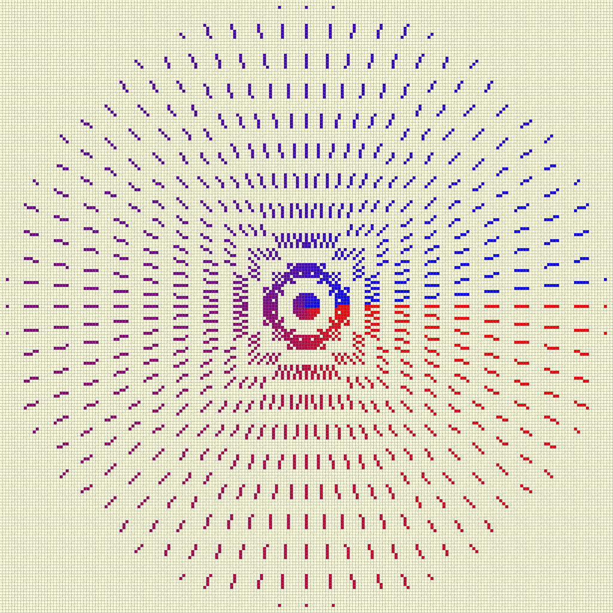

==============================
Dashed Lines and Rasterization
==============================

Base Dashed Line
================

    
      **Dashed Lines made by Zigl Algorithm**
      
      Note the square patterns

Now that we have the scripts for lines, antialiased lines and thick 
antialiased lines let's see if we can produce a good set of dashed lines.
To start let's choose the plain rasterized line, there is not much to choose
between the Bresenham and Zigl algorithms, other than the reason that Zigl's
algorithm will be extended for antialiasing and thick line antialiasing.

.. _dash-bres:

With direct access to the line drawing algorithm we can
simply switch the plotting on and off. Use the dash
tuple to create a list (**pattern**) of 1's and 0's corresponding to the 
lengths of the dashes and spaces.
Within the **range** part add an if clause to plot only when the list element
corresponds to a 1. The list is simply cycled within the for loop.

.. raw:: html

   

   
<a>Show/Hide <b> Dashed Line </b> One Pixel Wide  </a>

::

    def zigl_dash(dr, pta, ptb, dash=(), fill='black'):
        # check dash input
        if len(dash)%2 == 0 or len(dash) ==1:
            pass
        else:
            raise Exception('The dash tuple: {} should be one or an equal number '\
                        'of entries'.format(dash))

        dash = dash + dash if len(dash) == 1 else dash # single entry

        sum_dash = sum(dash)
    
        pattern = []
        while len(dash) > 0:
            dash0, *dash = dash
            pattern.extend([1] * dash0) # dashes
            dash0, *dash = dash
            pattern.extend([0] * dash0) # spaces
        if not pattern:
            pattern.append(1)

        count = 0
      
        x0, y0 = pta
        x1, y1 = ptb
      
        dx = x1 - x0
        dy = y1 - y0

        xsign = 1 if dx > 0 else -1
        ysign = 1 if dy > 0 else -1

        dx = abs(dx)
        dy = abs(dy)
      
        err = dx - dy
        dr = dx + 1 if dx > dy else dy + 1
      
        for x in range (dr): 
            if pattern[count] == 1:
                draw.point([x0, y0], fill= fill)
            e2 = err<<1
            
            if e2 >= -dx:
                err -= dy
                x0 += sx
                
            if e2 <= dy:
                err += dx
                y0 += sy
                
            count = count + 1 if count < sum_dash - 1 else 0

.. raw:: html

   

|

It should be noted how straightforward the creation of dashed lines is made 
by using rasterization, apart from adding a list that stores the pattern
with a count based on this list. The question of changing dash and space 
lengths has not been encountered.

Adjust for Slope
================

As of yet no attempt has been made to regulate the dash and space sizes 
relative to their orientation, if adjusted then the rectangular pattern in 
the figure above will become more :ref:`circular<sin-cos>`.

    
      **Adjusted Dashed Lines made by Zigl Algorithm**
      
      The square pattern is less pronounced

Alter the lengths of the dash and space elements according to the slope of 
the line, keeping  the same overall length. This means that when close to 45°
the dashes will shorten. Modify the script above, add an ``adjust`` option,
then when this option is set to **True** calculate the slope, and allow the
dash and space lengths to be modified dependant on the slope. If the slope 
is shallow base the length on cos, steep slopes base the length on sin. The
result has to be an integer rounded up to safeguard single dashes or spaces

.. raw:: html

   

   
<a>Show/Hide <b> Adjusted Dashed Line </b> One Pixel Wide  </a>

::

    def zigl_dash(dr, pta, ptb, dash=(5,5), fill='red', adjust=False):
        # check dash input
        if len(dash)%2 == 0 or len(dash) ==1:
            pass
        else:
            raise Exception('The dash tuple: {} should be one or an equal number '\
                        'of entries'.format(dash))
        dash = dash + dash if len(dash) == 1 else dash
        #sum_dash = sum(dash)
    
        x0, y0 = pta
        x1, y1 = ptb
        dx = (x1 - x0)
        dy = (y1 - y0)
    
        if adjust is True:
            slope = atan2(dy, dx)
            slope = slope if slope >= 0 else (2*pi + slope)

        dx = abs(dx)
        dy = abs(dy)
    
        pattern = []
        while len(dash) > 0:
            dash0, *dash = dash
            if adjust is True:
                dash0 = abs(int_up(dash0*cos(slope) if dx >= dy else dash0*sin(slope)))
            pattern.extend([1] * dash0) # dashes
            dash0, *dash = dash
            if adjust is True:
                dash0 = abs(int_up(dash0*cos(slope) if dx >= dy else dash0*sin(slope)))
            pattern.extend([0] * dash0) # spaces

        if not pattern:
            pattern.append(1)

        count = 0

        len_pattern = len(pattern)
        sx = 1 if x0 < x1 else -1
        sy = 1 if y0 < y1 else -1
        err = dx - dy
        dr = dx + 1 if dx > dy else dy + 1 

        for x in range (dr):
            if pattern[count] == 1:
                draw.point([x0, y0], fill= fill)
            e2 = err<<1
            
            if e2 >= -dx: 
                err -= dy 
                x0 += sx
                
            if e2 <= dy: 
                err += dx
                y0 += sy
        count = count + 1 if count < len_pattern -1 else 0

.. raw:: html

   

|

Adding Antialiasing
===================

    
      **Antialiased Dashed Lines**
      
      The square pattern shows

    
      **Antialiased Dashed Adjusted Lines**
      
      The square pattern has been broken up

Antialiasing can be simply added to the above scripts.

.. raw:: html

   

   
<a>Show/Hide <b> Dashed Line </b> Antialiased  </a>

::

    def plotDashAA(draw, pta, ptb, dash=(5,5), fill='black', adjust=False):
        # draw a black antialiased line on white (255) background
        # check dash input
        if len(dash)%2 == 0 or len(dash) ==1:
            pass
        else:
        raise Exception('The dash tuple: {} should be one or an equal number '\
                        'of entries'.format(dash))
        dash = dash + dash if len(dash) == 1 else dash

        x0, y0 = pta
        x1, y1 = ptb

        dx = (x1 - x0)
        dy = (y1 - y0)

        if adjust is True:
            slope = atan2(dy, dx)
            slope = slope if slope >= 0 else (2*pi + slope)

        dx = abs(dx)
        dy = abs(dy)

        pattern = []
        while len(dash) > 0:
            dash0, *dash = dash
            if adjust is True:
                dash0 = abs(int_up(dash0*cos(slope) if dx >= dy else dash0*sin(slope)))
            pattern.extend([1] * dash0) # dashes
            dash0, *dash = dash
            if adjust is True:
                dash0 = abs(int_up(dash0*cos(slope) if dx >= dy else dash0*sin(slope)))
            pattern.extend([0] * dash0) # spaces

        if not pattern:
            pattern.append(1)
        len_pattern = len(pattern)

        count = 0
        sx = 1 if x0 < x1 else -1
        sy = 1 if y0 < y1 else -1
        err = dx - dy                            # error value e_xy

        ed = dx + dy

        ed = 1 if ed == 0 else sqrt(dx*dx+dy*dy) # max(dx, dy) #
        dr = dx + 1 if dx > dy else dy + 1      # better plotting when steep
        
        for x in range (dr):                    # pixel loop
            if pattern[count] == 1:
                hue = int(255*abs(err-dx+dy)/ed)
                draw.point([x0, y0], fill=(hue, hue, hue))

            e2 = err
            x2 = x0
            
            if e2<<1 >= -dx:                    # y-step
                if e2+dy < ed and x < dr - 1 and pattern[count] == 1:
                    hue = int(255*(e2+dy)/ed)
                    draw.point([x0,y0+sy], fill=(hue, hue, hue))

                err -= dy
                x0 += sx
                
            if e2<<1 <= dy and x < dr - 1:      # x-step
                if dx-e2 < ed and pattern[count] == 1:
                    hue = int(255*(dx-e2)/ed)
                    draw.point([x2+sx,y0], fill=(hue, hue, hue))

                err += dx
                y0 += sy

            count = count + 1 if count < len_pattern -1 else 0

.. raw:: html

   

|

Since dashed lines can have small dash sizes it was felt that thick lines 
would not be appropriate, however we can add the default dictionary and 
enable colour choices, as seen in thick lines::

    ....
    def errs(comp, size,j):
        return 255 if comp == 255 else int((255-comp) * j / size) + comp
        
    diffs = defaultdict(list)
    diffs = defaultdict(lambda:back, diffs)
    for i in range(int(ed)+1):
        if fill == (0,0,0):
            diffs[i] = tuple(int(255*i/ed) for j in range(3))
        else:
            diffs[i] = tuple(errs(fill[j],ed,i) for j in range(3))
    ....
                draw.point((x0, y0), fill=diffs[abs(err-dx+dy)]) # main line
    ....
                draw.point([x0, y0+sy], fill=diffs[abs(e2+dy)])  # y-step
    ....
                draw.point([x2+sx, y0], fill=diffs[abs(dx-e2)])  # x-step
    ....

