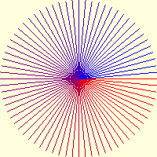
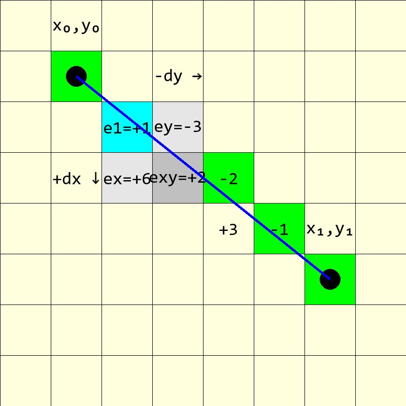
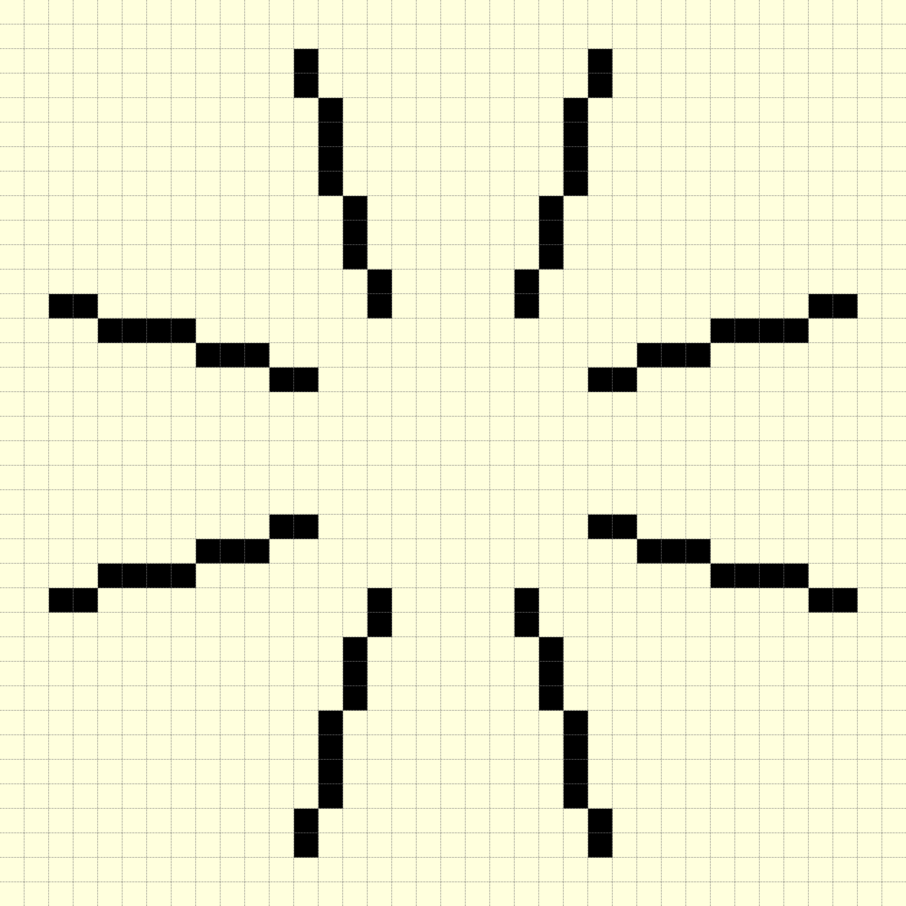

======================
Line Rasterization
======================

   
   Drawing lines at 5° intervals
   
   This used Alois Zigl's error algorithm

.. sidebar:: Theoretical Line Positioning.

   Both this algorithm and Bresenham's are based on integer arithmetic, it
   may be helpful to calculate with trignometric functions where the
   theoretical line sits inside or adjacent to a pixel.

.. _zigl:

When inspecting the Bresenham algorithm it was apparent that the position of 
the next pixel is computed using the displacement differences
between the actual and theoretical lines. Depending on how steep the gradient
is, the algorithm is biased to select pixels either above or below 
the theoretical line. 

   
   Line drawn from (x0, y0) to (x1, y1) showing the pixels activated for
   the rasterization algorithm. 
   
   The line is drawn down the page as on a monitor. 
   
   The green, blue and dark grey pixels are activated by this algorithm which
   are the same that would be activated by the Bresenham algorithm. 

`Alois Zigl <http://members.chello.at/easyfilter/Bresenham.pdf>`_ has a 
slightly different approach to Bresenham. 

Starting from an implicit line equation

.. math::

      (x_1 - x_0) \, (y - y_0) - (x - x_0) \, (y_1 - y_0) & = 0 \\
      \Delta{x} & = x_1 - x_0 \\
      \Delta{y} & = y_1 - y_0

As we move along the line we can say that the error ε, the difference 
between the pixel centre and theoretical line, is

.. math::

      ε = (y - y_0) \, \Delta{x} - (x - x_0) \, \Delta{y}

.. note:: Look carefully at the signs of the expressions. When computing the 
   error in the x-direction we use the negative Δy, and for the y-direction
   use the positive Δx.

Building on the example from `Alois Zigl <http://members.chello.at/easyfilter/Bresenham.pdf>`_
a straight line starts and finishes from (1, 1) to (6, 5), it has difference 
values of
Δx=5 and Δy=4, as we move one pixel away from the start, a shift in the 
x-direction has a smaller error than a shift in the y-direction, in fact the 
after swopping the differences, Δx and Δy, they become the errors, with a 
sign change in the x-direction.  

Moving diagonally the error is

.. math::

      ε_{xy} = (y + 1 - y_0) \, \Delta{x} - (x + 1 - x_0) \, \Delta{y} = ε + \Delta{x} - \Delta{y}

Moving in the x and y directions 

.. math::

     ε_x & = (y + 1 - y_0) \, \Delta{x} - (x - x_0) \, \Delta{y} = ε_{xy} + \Delta{y} \\
     ε_y & = (y - y_0) \, \Delta{x} - (x + 1 - x_0) \, \Delta{y} = ε_{xy} - \Delta{x}

The first step's error becomes

.. math::

      ε_1 = (y_0 + 1 - y_0) \, \Delta{x} - (x_0 + 1 - x_0) \, \Delta{y} = \Delta{x} - \Delta{y}

Moving from
(x0, y0) to the centre of (x1, y1), the start pixel has by definition no
error (green). The diagonal pixel(blue) e1 is (x+1, y+1) 
giving an error of 5 (0 + 5) in the y-direction (+dx) and -4 (0 - 4) in the 
x-direction, resulting in +1 (5 - 4). At the blue pixel there is a choice of 
the grey 
pixels (x+1, y+2), (x+2, y+1) or (x+2, y+2). The first pixel has an error of 
ex=6 (1 + 5), the second has an error ey=-3 (1 - 4) and the third an error of
exy=2 (1 + 1). The darker grey pixel is chosen because it only has an error 
of +2. The next 
diagonal (x+3, y+3) has an error of +3, but is not chosen because the pixel
(x+3, y+2) only has an error of -2. Starting from this pixel (x+3, y+2) the 
diagonal at (x+4, y+3) has an error of -1 (-2 +1). Although the 
Zigl's method is different, the result is exactly the same as for
Bresenham's algorithm.

This concept is very powerful and Alois has extended it to plotting ellipses,
circles and Bezier curves, all of which can then be antialiased. 

    
    Corrected Zigl Algorithm drawing in all sectors, x and y coordinates
    and differences flipped.
    
    The line with a differences of 10 and 3 is telling, if the algorithm
    shows the pattern correctly then it should be universal. Check the line 
    pattern against an algorithm that is known to be correct .

The following is a python script based on Alois' C program

.. raw:: html

   

   
<a>Show/Hide <b> Zigl Algorithm </b> Basic Line </a>

::

   def plotLine(draw, pta, ptb, fill='black', width=1):
    x0, y0 = pta
    x1, y1 = ptb
    dx = abs(x1 - x0)
    dy = -abs(y1 - y0)
    sx = 1 if x0 < x1 else -1
    sy = 1 if y0 < y1 else -1
    err = dx + dy                # error value e_xy

    for x in range (x0, x1+1):
        draw.point([x0, y0], fill= fill)
        e2 = err<<1
        if e2 >= dy:             # e_xy + e_x > 0
            err += dy
            x0 += sx
        if e2 <= dx:             # e_xy + e_y < 0
            err += dx
            y0 += sy

.. raw:: html

   

|

As it stands this script only works on a gentle incline, when the slope is
steep the line is foreshortened. However all is not lost! Use the method 
developed later for the antialiased line, it almost works in all octants 
except for vertical lines. Change the ``range`` conditions to account for steep
conditions, this then enables vertical lines to show.

.. _code-zigl:

.. raw:: html

   

   
<a>Show/Hide <b> Zigl Algorithm </b> Universal Line </a>

.. code-block:: python
   :emphasize-lines: 5, 6, 8-9, 11-12, 14-15, 17

   def plotLine(draw, pta, ptb, fill='black', width=1):
    x0, y0 = pta
    x1, y1 = ptb
    
    dx = x1 - x0 # abs
    dy = y1 - y0 # -abs
    
    sx = 1 if dx > 0 else -1
    sy = 1 if dy > 0 else -1
    
    dx = abs(dx)
    dy = abs(dy)
    
    err = dx - dy # +
    dr = dx + 1 if dx > dy else dy + 1 # better plotting when steep

    for x in range (dr): #  x0, x1+1 
        draw.point([x0, y0], fill= fill)
        e2 = err<<1
        if e2 >= -dx: # dy
            err -= dy # += dy
            x0 += sx
        if e2 <= dy: # dx
            err += dx
            y0 += sy

.. raw:: html

   

|

There are similarities with the second Bresenham :ref:`algorithm <bres>` 
when making it universal. Changes were
also made to the Alois' definition of sx and sy (x- and y-sign), so that the 
comparison was made with zero.

.. _zigl-line:

**BUT**

.. warning::

    The lines are not totally accurate. The antialiased lines plot the right 
    points with the right colour, but the main line does not follow the
    Bresenham line exactly, the antialiasing fills in the points left out
    by the main line and the main line fills in those left out by the 
    antialiasing. The final result is correct, but when trying to make 
    antialiased arrows by switching off one side or other of antialiasing
    there are unwanted light antialiasing pixels left behind that in fact
    had been plotted by the main plot.
    
    When the line is steep swop the main differences/errors.
 
.. raw:: html

   

   
<a>Show/Hide <b> Zigl Algorithm </b> Corrected Line with flipped 
    coordinates</a>

::

    def plotLine(draw, pta, ptb, fill='black', width=1):
    x0, y0 = pta
    x1, y1 = ptb

    dx = dx0 = abs(x1 - x0)
    dy = dy0 = abs(y1 - y0) 
    sx = 1 if x0 < x1 else -1
    sy = 1 if y0 < y1 else -1

    if dx0 > dy0:       # gentle incline
        dy = -dy
        dr = dx0 + 1
    else:               # steep slope
        dx = -dx
        dr = dy0 + 1
        dx, dy = dy, dx
    err = dx + dy 

    for j in range (dr):
        draw.point([x0, y0], fill= fill)
        e2 = err<<1
        if e2 >= dy:
            err += dy 
            if dx0 > dy0:
                x0 += sx
            else:
                y0 += sy
        if e2 <= dx:
            err += dx
            if dx0 > dy0:
                y0 += sy
            else:
                x0 += sx

.. raw:: html

   

|

Test this out on a line that changes 10 in the x-coordinate and 3 in the
y-coordinate, now make it plot in all 8 sectors.

.. raw:: html

   

   
<a>Show/Hide <b> Testing Algorithms </b> draw in all 8 sectors </a>

::

    if __name__ == "__main__":
        w,h = 41,41
        
        image = Image.new('RGB', (w,h), '#FFFFDD')
        drawl = ImageDraw.Draw(image)
        
        a = (26,23),(23,26),(17,26),(14,23),(14,17),(17,14),(23,14),(26,17)
        b = (36,26),(26,36),(14,36),(4,26) ,(4,14), (14,4), (26,4) ,(36,14)
        
        for i in range(len(a)):
            plotLine(drawl, [a[i][0], a[i][1]], [b[i][0], b[i][1]],
                fill='black')
                
        image.show()

.. raw:: html

   

|

After running this script check it against a Bresenham and standard Pil line 
in particular note the patterns of long and short lines, these should match 
no matter which algorithm is used. 