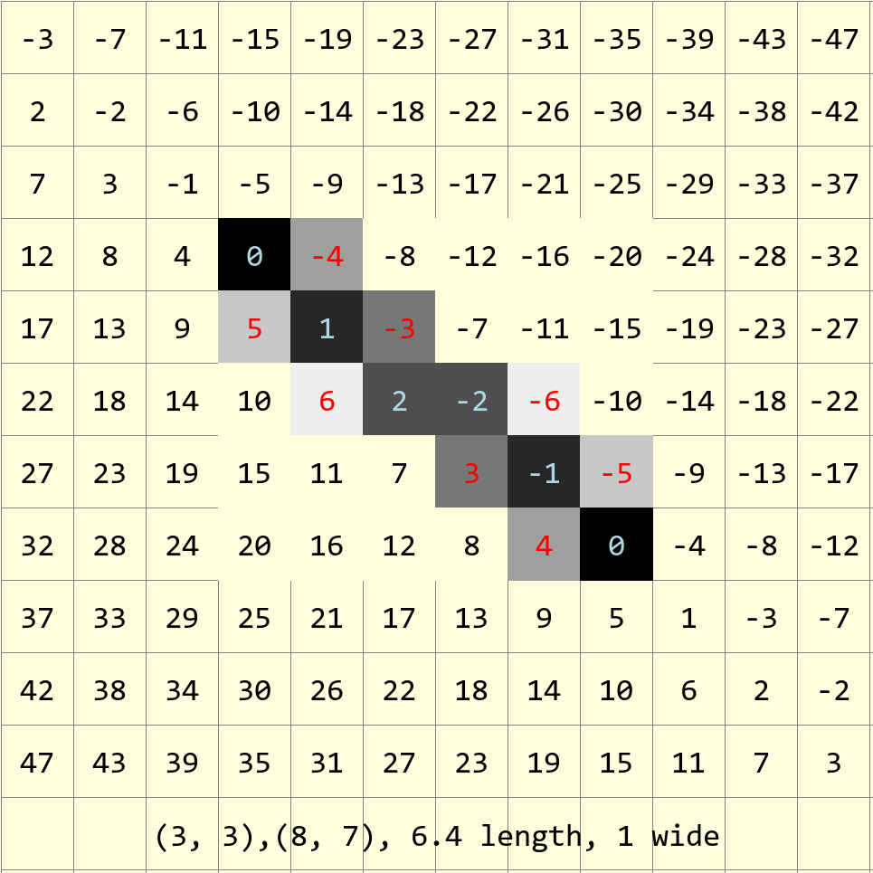
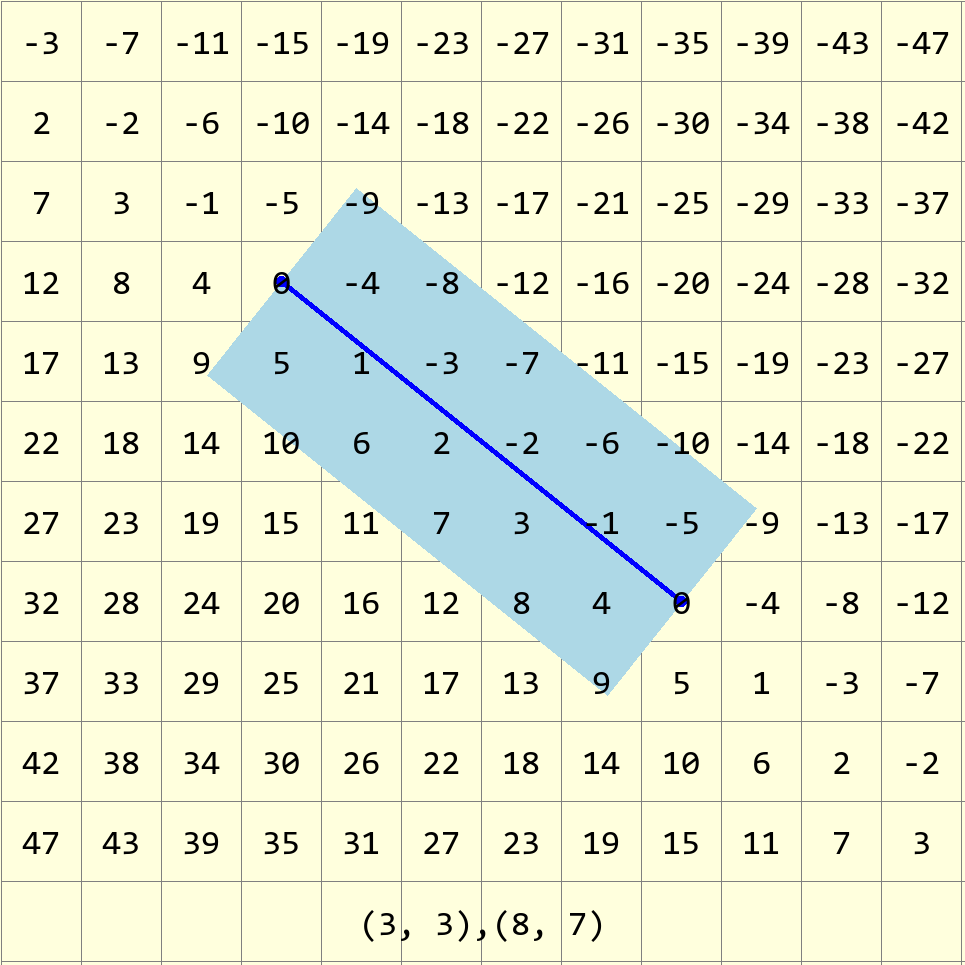
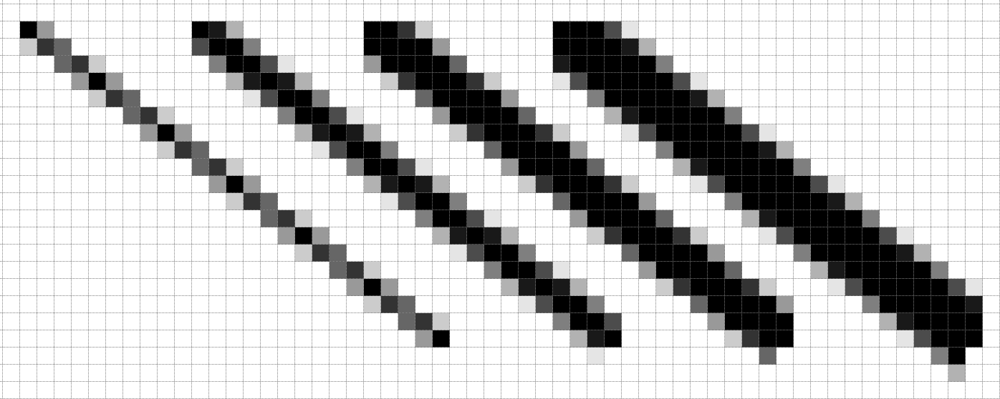
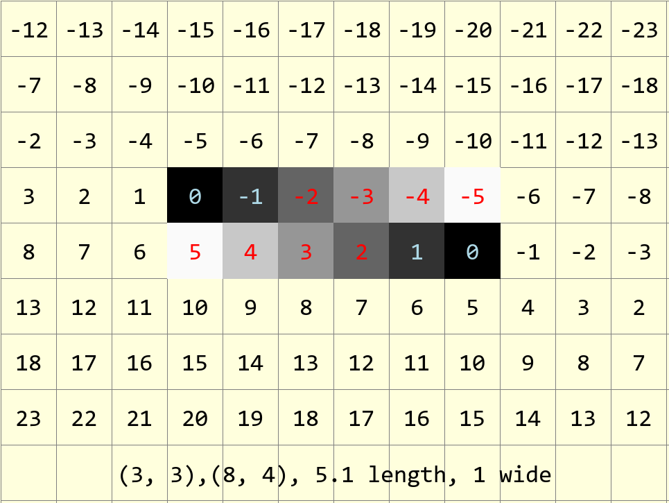

=======================
Thick Antialiased Lines
=======================

.. _differences:

The thick antialiased lines can be made by modifying the simple antialiased
line. In effect the line that is one pixel wide, has two regions either side
of the line that use the difference values to alter the colour of the 
antialiasing pixel. Low numbers are closer to the theoretical line and will 
be darker, whilst higher numbers will be lighter. 

   
   Antialiased line 1 pixel wide, after calculating the errors the line can
   be shown just by the colour change. In this example the main line follows 
   the darker pixels with light blue values.
   
   It can be seen that just by adjusting the criterion to display a colour 
   one can alter the line width provided that the algorithm moves to the 
   adjacent pixels.

   
   A thick theoretical line 2 pixels wide from (3,3) to (8,7), showing the 
   differences between the pixel positions and the line.
   
   The light blue rectangle is a 2 pixel wide (scaled) line, a single pixel 
   wide antialiased line would activate all pixels having a difference of 6 
   or less, the
   two pixel wide antialiased line would activate pixels having a difference 
   of 9 or less.
   Pixels having a difference of 3 or less would be coloured black.

For thick lines imagine the band either side of the theoretical line. The 
pixels within this band will darken, corresponding to the line width, and 
those pixels either side and adjacent to the band will be used as 
antialiasing pixels. We can account for the single line thickness as having
two lines of antialiasing pixels, each line corresponding to half a line 
width. The algorithm follows this reasoning in that the single width line
is drawn first with antialiasing colours, when the two antialiasing parts 
are added some adjacent pixels are not coloured. Larger 
widths correspond to keeping the central line as before and adding the 
antialiasing in a larger band of antialiasing. The antialias values are 
calculated by dividing the line roughly in two, so that the central line 
darkens and the antialiasing occurs at a larger offset.

.. _thick-lines:

.. raw:: html
	:file: ../_static/thick_lines.html

..

    +---------------+----------------+---------------+---------------+
    |       .. centered:: **Thick Antialiased Lines**                |
    +===============+================+===============+===============+
    |  1 pixel wide | 2 pixels wide  | 3 pixels wide | 4 pixels wide |
    +---------------+----------------+---------------+---------------+
    |    ½ + 0 + ½  |   ½ + 1 + ½    |   ½ + 2 + ½   |    ½ + 3 + ½  | 
    +---------------+----------------+---------------+---------------+

The single pixel line is antialiased by taking the absolute difference value
divided by the line length (ed) multiplied by 255. Working with thick lines 
subtract :math:`ed * (width - 1) / 2` from the difference value (negative 
values become zero). 

   
   Antialiased lines 1, 2, 3 and 4 pixels wide
   
   There is no antialiasing before the start and the antialiasing at the end 
   has been curtailed.

Lines near 45° look good, but at the main axes the lines are offcentre, 
where the lines have no antialiasing, use the ordinary line from
PIL instead. Otherwise Alois has made good looking antialiased lines. 

Antialias Limits
================

At present the antialiasing width factor is multiplied by a common term **ed**,
if the line is very shallow or steep, this does not always reflect the change 
in differences as steps are made in the x and y directions.

   
   Line between (3,3) and (8,4) overall length 5.1.
   
   Steps in the x-direction change the differences by -1, but in the
   y-direction by 5. Compare these differences to the 
   :ref:`figure<differences>` at the start of this section.

.. raw:: html

   

   
<a>Show/Hide <b> Antialiased Line </b> Wide Lines </a>

::

   def plotWideLineAA(draw, pta, ptb, fill='black', width=1):

    x0, y0 = pta
    x1, y1 = ptb
    dx = abs(x1 - x0)
    dy = abs(y1 - y0)
    sx = 1 if x0 < x1 else -1
    sy = 1 if y0 < y1 else -1
    err = dx - dy
    ed = dx + dy
    ed = 1 if ed == 0 else sqrt(dx*dx+dy*dy)
    dr = dx + 1 if dx > dy else dy + 1          
    
    for x in range (dr):
        hue = max(0,int(255*(abs(err-dx+dy)-ed*(width-1)/2)/ed)) 
        draw.point([x0, y0], fill=(hue, hue, hue))
        e2 = err
        x2 = x0
        if e2 << 1 >= -dx:                   # vertical aa below line
            e2 += dy
            y2 = y0
            while e2 < ed*(width+1)/2 and (y1 != y2 or dx > dy):
                hue = 0 if dy==0 else max(0, int(255*(abs(e2)-dy*(width-1)/2)/ed))
                y2 += sy
                draw.point([x0, y2], fill=(hue, hue, hue))
                e2 += dx
            e2 = err
            err -= dy
            x0 += sx
        if e2 << 1 <= dy:                   # horizontal aa right of line
            e2 = dx - e2
            while e2 < ed*(width+1)/2 and (x1 != x2 or dx < dy):
                hue = 0 if dx == 0 else max(0, int(255*(abs(e2)-dx*(width-1)/2)/ed))
                x2 += sx
                draw.point([x2 , y0], fill=(hue, hue, hue))
                e2 += dy
            err += dx
            y0 += sy

.. raw:: html

   

|

As can be seen the script closely follows the single width antialiased 
:ref:`line<aaline>`. The main differences are in how the hue is calculated, 
where an amount is subtracted dependant on half the width, also the ``while``
conditions have been extended, this allows the antialiasing to widen the basic
line. Antialising is limited by the while clause to ed*(width+1)*2 as 
opposed to the original ed*width.

Reduce Antialias Duplication
============================

The antialias values are duplicated, so
add a lookup dictionary to calculate the **hue** directly from the 
error to speed up the script::

    .....
    diffs = {}
    for i in range(int(ed)):
        diff = int(255*abs(i)/ed)
        diffs[i] = diff
    ....
        hue = diffs[abs(err-dx+dy)]             # main line
    ....
            hue = diffs[abs(e2+dy)]             # y-step
    ....
            hue = diffs[abs(dx-e2)]             # x-step

Pixel differences with larger values than exist in the dictionary will 
produce an error. Use a defaultdict and add a default equal to the background
colour (**back**)::

    from collections import defaultdict
    ....
    diffs = defaultdict(list)
    diffs = defaultdict(lambda:back, diffs)

Allow for other Colour Fills
============================

So far thick antialiased lines will create greys, but
with a coloured line each **hue** component needs to be separately adjusted, not
merely copied from the source to the other two components. For the best 
results at least one of the RGB components should be 0, which allows the 
colour to change across the full range.

The plan is to take each component and step through the line size (**ed**)
and adjust the value according to the step value. Store the 
RGB tuple in our lookup dictionary::

    ....
    def errs(comp, size,j):
        return 255 if comp == 255 else int((255-comp) * j / size) + comp
        
    diffs = defaultdict(list)
    diffs = defaultdict(lambda:back, diffs)
    for i in range(int(ed)+1):
        if fill == (0,0,0):
            diffs[i] = tuple(int(255*i/ed) for j in range(3))
        else:
            diffs[i] = tuple(errs(fill[j],ed,i) for j in range(3))
    ....
                draw.point((x0, y0), fill=diffs[abs(err-dx+dy)]) # main line
    ....
                draw.point([x0, y0+sy], fill=diffs[abs(e2+dy)])  # y-step
    ....
                draw.point([x2+sx, y0], fill=diffs[abs(dx-e2)])  # x-step
    ....

This modification can be added to the thick antialiased lines. just remember 
that the input should be a positive integer after the difference is adjusted 
for width, however the change in colour is straightforward.