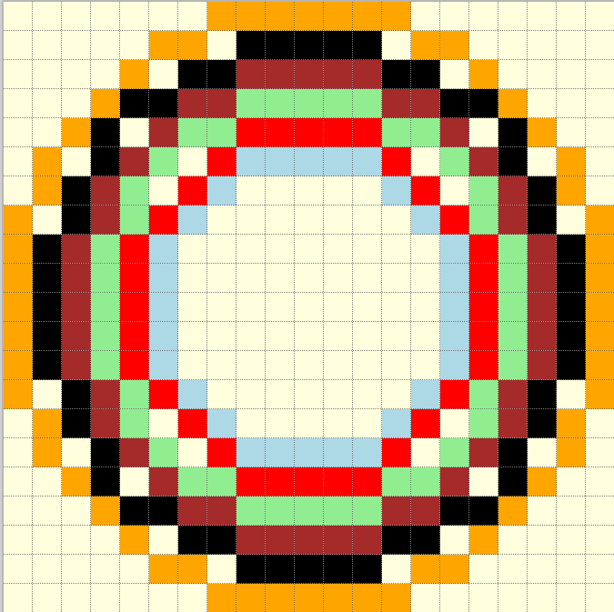
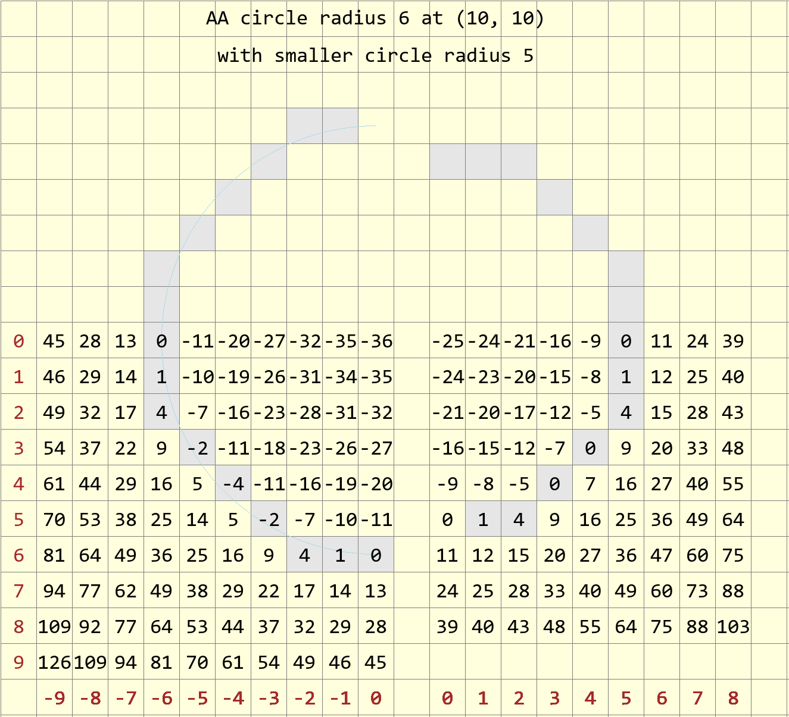

================
Thick Circles
================

   **Concentric circles**
   
   Often when drawing concentric circles, based on the single width script, 
   there are gaps between the circles. (the paths of each circle differ)

Using thick :ref:`lines<thick-lines>` as an example, assume that the circles 
can use a similar logic to change the difference values as the circles become
thicker. Use the simple Zigl circle modified to plot points in an octant, 
as used in the mid-point algorithm. This 
makes it easier to formulate the pixel positions
and their differences from the true circle.

.. note:: The standard mid-point circle plots from 0° to 45°. When a pixel  
   sits exactly on the 45° line it will be duplicated, on the other hand when 
   the 45° line is between two pixels, there is no duplication. All pixels
   need to be drawn at least once, so the condition of the while clause has
   be inclusive. Prevent
   duplication by plotting the pixels on the 45° line in only half the 
   sectors by deactivating ``all8`` in the function plotpoints. 
   
   Check out the :ref:`circle<compare>` comparison to see where the 45° line
   sits on various circles.

.. _amalgam:

The following script is an amalgam of the mid-point algorithm and the
Zigl error values used as differences
for antialiased circles 1 pixel wide

.. raw:: html

   

   
<a>Show/Hide <b> One Pixel Wide Antialiased Amalgam </b> Circle </a>

::

    def plotpoints(dr, xm, ym, x,y, fill, all8=1):
        # plots all 8 sectors or only 4 sectors 
        if all8 == 1:
            dr.point((xm-x, ym+y), fill)               # I. Octant
            dr.point((xm-y, ym-x), fill)               # III. Octant
            dr.point((xm+x, ym-y), fill)               # V.  Octant
            dr.point((ym+y, xm+x), fill)               # V!!. Octant

        dr.point((xm+x, ym+y), fill)                   # IV. Octant
        dr.point((ym+y, xm-x), fill)                   # II. Octant
        dr.point((xm-x, ym-y), fill)                   # VIII. Octant
        dr.point((xm-y, ym+x), fill)                   # VI. Octant

    def plotCircle(dr, centre, r, fill=(0,0,0), back=(255,255,255)):
        xm, ym = centre
        # draw a black antialiased circle on light background
        x = -r
        y = 0                                   # IV. Octant from left to bottom left
    
        err = 2 - 2 * r                         # initial difference
        maxd =  (r << 1) - 1                    # 1 pixel inwards from start
      
        def errs(comp, size,j):
            return 255 if comp == 255 else int((255-comp) * j / size) + comp

        diffs = defaultdict(list)
        diffs = defaultdict(lambda:back, diffs)
        for i in range(int(maxd)+1):
            if fill == (0,0,0):
                diffs[i] = tuple(int(255*i/maxd) for k in range(3))
            else:
                diffs[i] = tuple(errs(fill[k],maxd,i) for k in range(3))
        
        # plots 4 initial points, must be at fill colour
        plotpoints(dr, xm, ym, x, y, fill, all8=0)

        while -x > y + 1:
            err0 = err

            if (err0 <= y):
                y += 1
                err += y * 2 + 1            # e_xy+e_y < 0

            if (err0 > x or err > y):          # e_xy+e_x > 0 or no 2nd y-step
                x += 1
                err += x * 2 + 1            # -> x-step now

            e2 = err-(2*y+1)-(2*x+1)
            out = abs(e2)
            plotpoints(dr, xm, ym, x, y, diffs[out], \
                    all8 = (1 if (xm+x, ym+y) != (xm-y, ym-x) else 0))

            ein = abs(e2+2*x+1)
            if ein < maxd:
                plotpoints(dr, xm, ym, x+1, y, diffs[ein], \
                    all8 = (1 if (xm+x, ym+y) != (xm-y, ym-x) else 0))
        
            eout = e2+2*y+1
            if eout < maxd:
                plotpoints(dr, xm, ym, x, y+1, diffs[eout], \
                    all8 = (1 if (xm+x, ym+y) != (xm-y, ym-x) else 0))

.. raw:: html

   

|

The function **plotpoints** either plots all eight octants or only four to prevent
duplicating pixels. Note that the **while** condition has also been changed
from that normally shown to help prevent duplicating pixels. Use plotpoints 
(all8 set to 0) to plot only four pixels at the circle start.

Build on this script for thicker antialiased circles.

Two Pixel Thick Circles Compared
================================

.. raw:: html

   

   
<a>Show/Hide <b> Comparison between Circles </b> 2 Pixel Thick </a>

.. list-table:: **Comparison between 2 pixel thick Circles**
   :widths: 10 650
   :header-rows: 1
   :stub-columns: 1

   * - Radius
     - Antialiased Circle 2 pixels Thick and 2 Concentric PIL Circles
   * - 5
     - .. figure:: ../figures/bres/thick_aa_circle_5.png
             :width: 277
             :height: 277
   * - 6
     - .. figure:: ../figures/bres/thick_aa_circle_6.png
             :width: 324
             :height: 324
   * - 7
     - .. figure:: ../figures/bres/thick_aa_circle_7.png
             :width: 372
             :height: 372
   * - 8
     - .. figure:: ../figures/bres/thick_aa_circle_8.png
             :width: 420
             :height: 420
   * - 9
     - .. figure:: ../figures/bres/thick_aa_circle_9.png
             :width: 468
             :height: 468
   * - 10
     - .. figure:: ../figures/bres/thick_aa_circle_10.png
             :width: 516
             :height: 516
   * - 11
     - .. figure:: ../figures/bres/thick_aa_circle_11.png
             :width: 564
             :height: 564
   * - 12
     - .. figure:: ../figures/bres/thick_aa_circle_12.png
             :width: 600
             :height: 600     

.. raw:: html

   

|

The PIL circles above, were simply drawn as two filled circles. 
To avoid gaps draw the first circle set to the outer radius 
the smaller circle set to the background colour and
sized to make the required width. 

Thicker Antialiased Circles
===========================

.. topic:: Combining Circles then Floodfill

    Thicker circles could be problematic, since there often will 
    be gaps between two concentric circles. One solution would be to superimpose
    two antialiased circles with the outer circle with its inner 
    antialiased pixels set to black. The inner circle would run with normal inner
    antialias pixels but no
    outer antialiasing pixels. Build up to a two and three pixel wide circle, once 
    the width is larger use two half antialiased circles, and flood fill the 
    inner part. The flood fill often leaked through one of the two containing 
    circles and had to have additional antialiasing pixels. Quite apart from
    having to check each size, the additional antialiasing pixels did not conform
    to the antialiasing requirements.

Base the next script on the :ref:`amalgam<amalgam>` script above. Only plot
one antialiased circle and increase the number of inner antialiasing pixels.
This means that the main circle will be the nominal diameter and the width
grows inwards. The smallest circle will have its colour adjusted in much
the same way as the main circle, but will be plotted as if it was a set of  
inner antialias pixels. The pixels between the outer and inner main circles 
will be black. Duplication is likely to increase on the 45° line but this 
can be solved. 

With a 2 pixel thick circle the colour adjustment of the two main circles
will match and do not look too good, it looks better when the smaller 
circle's colour is adjusted. Luckily we can compute the difference values of 
the smaller circle and its inner antialias pixels as if it was a standalone 
circle quite easily. 

The difference/
error value for a pixel is :math:`x^2 + y^2 - Ro^2` relative to the outer
radius, and is :math:`x^2 + y^2 - Ri^2` relative to the inner
radius - the x,y coordinates are the
same since the circles are concentric, so the difference in errors is
:math:`Ro^2 - Ri^2`, which becomes :math:`(Ro + Ri) \times (Ro - Ri)`. For a
2 pixel wide circle the error simply becomes e - (Ro + Ri). see the figure 
below.

   **Differences for 6 and 5 radius circles**
   
   Left hand side are the differences for a 6 pixel radius circle, opposite
   a 5 pixel radius circle. Starting at (-6,0) the error on the 6 radius
   circle is 0, moving one square right (-5,0) the error is -11, square 
   (-5,0) on the 5 radius circle has an error of 0. Corresponding squares
   will have a difference of 11 between circles.

Moving along the larger circle one square to the right of the main circle
goes from (-5,0) to (-4,3) the errors are -11, -10, -7, -11, going along 
the same path in the smaller circle the errors are 0, 1, 4, 0 (this follows 
the main path of the inner circle), the difference
in errors is +11 at each square. A similar difference exists when we trace 
the path of the inner antialias pixel -9, -8, -5, -7 (one square to the right
of the inner main path), becomes two sqares right of 
the main circle path -20, -19, -16, -18. 

.. _thickcircles:

.. note:: Ensure that the starting point for the inner circle is found with 
   the correct difference / error calculated from the outer circle before 
   finding the inner circle difference value. Use it for smaller widths, 
   which is our immediate interest. 

.. raw:: html

   

   
<a>Show/Hide <b> Thick Circle </b>  Antialiased </a>

::

    def plotpoints(dr, xm, ym, x, y, fill, all8=1):
        # plots all 8 sectors or only 4 sectors in the while loop
        if all8 == 1:
            dr.point((xm-x, ym+y), fill)               # I Octant
            dr.point((xm-y, ym-x), fill)               # III. Octant
            dr.point((xm+x, ym-y), fill)               # V  Octant
            dr.point((ym+y, xm+x), fill)               # V!!. Octant

        dr.point((xm+x, ym+y), fill)               # IV . Octant
        dr.point((ym+y, xm-x), fill)               # II Octant
        dr.point((xm-x, ym-y), fill)               # VIII. Octant
        dr.point((xm-y, ym+x), fill)               # VI Octant

    def plotOutCircle(dr, xm, ym, r, width, fill=(0,0,0), back=(255,255,255)):
        # use outermost circle radius then decrease
        # xm, ym = centre
        # draw a dark antialiased circle on light background
        r0 = r
        x = -r
        y = 0                         # III. Octant from left to bottom left

        err = 2 - 2 * r                         # initial difference

        #maxd =  (r << 1) # - 1                 # 1 pixel inwards from start

        maxdi = [0]
        for n in range(0, width+1):
            maxdi.append(maxdi[n] + 2 * (r-n) -1)
        maxdi.remove(0)
        maxd = maxdi[0]
        # ensure inner aa working normally
        # find maxd of smallest main circle
        maxdsm = 2 * (r-width+1) - 1
        # thick factor used outer main lines
        thfact = (width-1)/2
        
        def errs(comp, size,j):
            return 255 if comp == 255 else int((255-comp) * j / size) + comp

        diffs = defaultdict(list)
        diffs = defaultdict(lambda:back, diffs)
        for i in range(maxd):
            if fill == (0,0,0):
                diffs[i] = tuple(int(255*i/maxd) for k in range(3))
            else:
                diffs[i] = tuple(errs(fill[k],maxd,i) for k in range(3))
                
        diffsm = defaultdict(list)
        diffsm = defaultdict(lambda:back, diffsm)
        for i in range(maxdsm):
            if fill == (0,0,0):
                diffsm[i] = tuple(int(255*i/maxdsm) for k in range(3))
        else:
            diffsm[i] = tuple(errs(fill[k],maxdsm,i) for k in range(3))

        while -x > y - 1:                       # main loop
            err0 = err
            e2 = err-(2*y+1)-(2*x+1)
            ea = abs(e2)
            out = max(0,int(ea-thfact)) 
            plotpoints(dr, xm, ym, x, y, fill=(diffs[out] if out > 0 else fill),
                    all8 = (1 if (xm+x, ym+y) != (xm-y, ym-x) \
                    or (x==-r and y == 0) else 0))

            # fill out diagonals
            x0 = -x
            eout = abs(e2 + 2*x0 + 2*y + 2)
            if eout < maxd:
                plotpoints(dr, xm, ym, x-1, y+1, diffs[eout],
                    all8 = (1 if (xm+x, ym+y) != (xm-y, ym-x) else 0))

            ein = e2
            x0 = -x
            for n in range(0, width):
                ein = ein-(2*(x0-n)-1)
                e0 = -ein

                if n < width -2:
                    out = fill
                elif n == width-1:
                    # smallest main circle correct differences 
                    out = diffs[abs(int(e0-maxd*thfact/10))] \
                        if n == 0 else diffsm[e0-maxdi[n-1]]
                else:
                    out = diffsm[max(0,(abs(e0-maxdi[n])-maxdsm*thfact/10))]
                plotpoints(dr, xm, ym, x+n+1, y, out,
                        all8 = (1 if (xm+x, ym+y) != (xm-y, ym-x) else 0))

            if (err0 <= y):
                y += 1
                err += y * 2 + 1            # e_xy+e_y < 0

            if (err0 > x or err > y):          # e_xy+e_x > 0 or no 2nd y-step
                x += 1
                # aa missed by diagonals
                eout = abs(e2 + 2*y - 1)
                plotpoints(dr, xm, ym, x-1, y, diffs[eout],
                    all8 = (1 if (xm+x, ym+y) != (xm-y, ym-x) else 0))
                err += x * 2 + 1            # -> x-step now

.. raw:: html

   

|

To prevent the inner antialiasing pixels encroaching on each other,
additional conditions are included in the script, more than for a single
pixel wide circle. 
The outer antialiasing pixels have the opposite problem, and require 
additional pixels inserted to fill the gaps. Use figures such as that
for a :ref:`theoretical antialiased circle<theoretical>` to check on which 
outer pixels need to show. The two innermost pixel plots are computed as 
though lying on a smaller circle, so require **diffsm** a separate hue 
dictionary.
