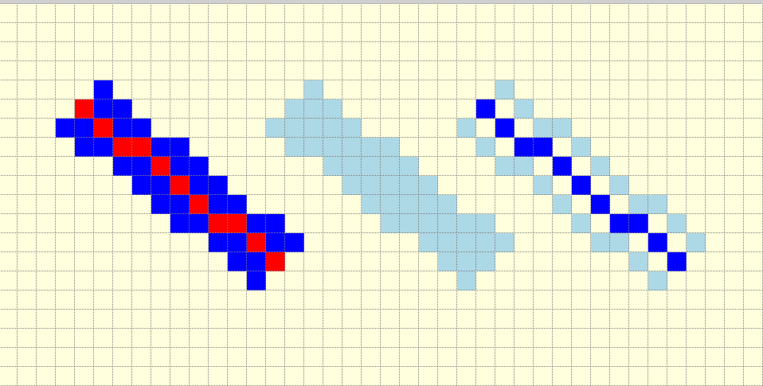

===========
Thick Lines
===========

Normally we are only concerned with thick lines up to 6 pixels thick when 
drawing shapes, otherwise use polygons.

Before looking at anti-aliased thick lines, it is as well to check out simple
thick lines. One might use multiple single lines, this could work for
two lines used as a 2 pixel wide line, but when there is a 3 pixel wide line, 
there are spaces in between the lines. The shape of the PIL thick line is 
the same as a PIL polygon. When the polygon is used first check whether it 
fits the Bresenham algorithm.

When drawing horizontal or vertical thick lines there are no surprises. The
lines are centralised when the width has an odd number, even widths require 
an extra line below the horizontal line or to the right of a vertical line.

For 45° lines the width does not correspond to the diagonal distance. The 
line can be centralised for both even and odd widths. The actual width of
standard PIL lines
do not change beween 3 and 4 pixels wide nor between 4 and 5 pixels wide,
so a 6 pixel wide line is shown only as 4 pixels wide. As we are only trying 
to see what is judged to be acceptable before trying to make thick 
antialiased lines, these anomolies are taken as potential problem areas.

   
   3 pixel wide line, polygon and line outline of the thick line.
   
   PIL line dark blue 3 wide with red line starting and finishing at the same
   points, the pale blue polygon imitates the shape of 3 wide line. Skeletal
   shape is 3 parallel lines set at the same distance apart as the PIL thick
   line.

Using a line that has 10 pixels along the x-axis and 8 pixels along the 
y-axis, draw a line 3 pixels wide in blue, superimpose a red line 1 pixel
wide. Compare the shape to a polygon in light blue, and lines drawn around 
the outline also in light blue. The thick line corresponds to a polygon
whereas the skeletal lines do not match either of the other two, which were
polygon based. A dark blue central line has
been used for the skeletal lines, note that even though there are 3 lines 
present to give
3 pixels wide the coverage is incomplete.

.. figure:: ../figures/bres/thick_line_2w.png
   :width: 479
   :height: 319
   :align: center
   
   PIL pale blue line 2 pixels wide, two grey lines drawn in parallel
   
Similar to the 3 pixel wide drawings. It can be seen that thick line drawing 
is not without its problems. The 2 wide line is centralised over the single
line. Using the same strategy for a 3 wide line results in a line that could
be mistaken for a 5 wide line, but the lines do progressively change at each 
width.

