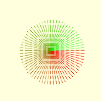

=======================
Resampling Antialiasing
=======================

Both forms of dashes were made into an antialiasing form. As the dashed line
is only a part of the main image it is best to draw the dashed line as a 
separate image on a transparent background, then paste it back into the main 
image. As seen in
`Antialiasing <https://tkinterttkstyle.readthedocs.io/en/latest/08down_to_earth.html#antialiasing>`_
the method previously used was to draw into an enlarged image, nine times 
larger than the final size, then resize the image using a Lanczos resampling 
filter. The nine times enlargement factor and Lanczos resampling filter were 
used because there were curved lines, with straight lines it should be 
possible to use cubic resampling and only 2 times enlargement factor.

As we are pasting back into the main image we need to know the relative
positions of the enlarged image to the final image. To keep the image sizes 
within the smallest size possible size the enlarged image to just accommodate
the line. When drawing the line in an enlarged width remember that the line's 
centre is used to position the line, but without adjustment
half the line is lost on vertical and horizontal lines. As the sloping lines 
can have
their ends shaved off, make sure that the image is slightly enlarged, and the 
line repositioned slightly::

    e = 9 # enlargement factor
    off = e // 2 # offset of line
    .....
    
    # sort out image width and height, must be large enough for line width
    # original image size
    w0 = max(abs(end_pos[0] - start_pos[0] +3 ), 1)
    h0 = max(abs(end_pos[1] - start_pos[1] +3 ), 1)

    # enlarged image size
    wi = max(abs(x1-x0)*e + 3 * e, 1*e)
    ht = max(abs(y1-y0)*e + 3 * e, 1*e)
    .....
    if x0 <= x1 and y0 < y1:
        # first quadrant
        x1 = wi - 1 + off
        y1 = ht - 1 + off
        x0 = 0 + off
        y0 = 0 + off
        st = start_pos
    elif x1 < x0 and y0 <= y1:
        # second quadrant
        x1 = 0 - off
        y1 = ht - 1 + off
        x0 = wi - 1 - off
        y0 = 0 + off
        st = start_pos[0] - w0 + 1, start_pos[1]
    elif x1 <= x0 and y1 < y0:
        # third quadrant
        x1 = 0 - e
        y1 = 0
        x0 = wi - 1 - e
        y0 = ht - 1
        st = start_pos[0] - w0 + 1, start_pos[1] - h0 + 1
    elif x0 < x1 and y1 <= y0:
        # fourth quadrant
        x0 = 0 + off
        y0 = ht - 1 - off
        x1 = wi - 1 + off
        y1 = 0 - off
        st = start_pos[0] , start_pos[1] - h0 + 1
    .....
    
    imaa = Image.new('RGBA', (wi, ht), (255,255,255, 0))
    drawaa = ImageDraw.Draw(imaa)
    ....
    
    imaa = imaa.resize((w0,h0), resample=Image.LANCZOS)
    im.paste(imaa, (st), imaa)

Every quadrant needs to be separately programmed. To check the results make 
an array of lines with the same
starting point and drawn at 5° intervals similar to those used before.

    
    Antialiasing with sin and cos to adjust lengths
    
    There appears to be a problem with lines adjacent to the vertical and
    horizontal, they appear too close to the main ordinates.

The major ordinates needed no antialiasing, this allowed us to use tighter
sizes giving better control on the output image::

    theta = theta if theta >= 0 else theta + 2 * pi
    ....
    
    if theta in (0, pi/2, pi, 3*pi/2, 2*pi):
        w0 = max(abs(end_pos[0] - start_pos[0]), 1)
        h0 = max(abs(end_pos[1] - start_pos[1]), 1)

        wi = max(abs(x1-x0)*e, 1*e)
        ht = max(abs(y1-y0)*e, 1*e)
    else:
        w0 = max(abs(end_pos[0] - start_pos[0] +3 ), 1)
        h0 = max(abs(end_pos[1] - start_pos[1] +3 ), 1)

        wi = max(abs(x1-x0)*e + 3 * e, 1*e)
        ht = max(abs(y1-y0)*e + 3 * e, 1*e)
    ....
    
    if theta in (0, pi/2, pi, 3*pi/2):
        imaa = imaa.resize((w0,h0), resample=0)
    else:
        imaa = imaa.resize((w0,h0), resample=Image.LANCZOS)
    im.paste(imaa, (st), imaa)

Draw a rectangle and see whether the lines overlap or display some other 
unwanted characteristic.

    Running the unantialiased major ordinates.
    
    The pattern begins at the starting coordinates and finishes before the
    ending coordinates.

A similar exercise was made for the tan based function.

.. _tan:

    
    Antialiasing using tan to adjust lengths
    
    The line lengths are almost equal, showing a strong pattern.
    There also appears to be a problem with lines adjacent to the vertical 
    and horizontal, they appear too close to the main ordinates.

If resampling antialiasing was used then using tan would be the way to go, 
but the next :ref:`section<dash-bres>` should produce a better result.

    Running the unantialiased on the major axes.
    
    The pattern begins at the starting coordinates and finishes before the
    ending coordinates.