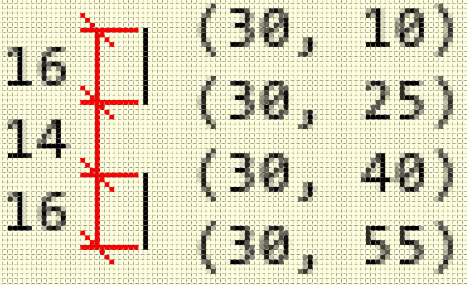
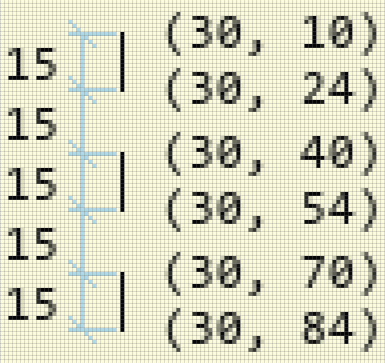

============
Line Example
============

Naive Lines and Gap
-------------------

As a starting point create two vertical lines 15 pixels long and 15 pixels 
apart.  Start from the coordinate (30, 10). You should have a script looking
something like the start of the following.

.. container:: toggle

    .. container:: header

        *Show/Hide Code* 00test_line_start_finish.py

    .. literalinclude:: ../examples/dashes/00test_line_start_finish.py

Look carefully at the result, enlarge it so that you can count the number of
pixels. Probably the line sizes are too long and the space is too short.

    
    Drawing two lines and gap with equally spaced coordinates
    
    Although the coordinates are 15 pixels apart, on inspection the lines
    are 16 pixels long and the gap 14 pixels.

Enforce Correct Line and Gap Sizes
----------------------------------

Change the coordinates to achieve equal spacing on the resulting drawing. 
Add an extra gap and line, to give six coordinates. Alter the first script
to give something like.

.. container:: toggle

    .. container:: header

        *Show/Hide Code* 01line_start_finish.py

    .. literalinclude:: ../examples/dashes/01line_start_finish.py

.. sidebar:: Coordinate Pairs

    The coordinates are obviously paired as x and y, but each line uses two 
    pairs of coordinates, so the first set of coordinates (30, 10) is paired 
    with the second set (30, 24) to draw a line. The gap size is made by the 
    last of this set (30, 24) and the start of the next pair (30, 40).

Look at the pairs of coordinates, the first pair is the same as 
before, but the second pair is changed by one pixel. This shortens 
the line and increases the gap. As it happens both changes cancel each other 
out when we come to the start of the next pair of coordinates, which in their
turn need to be adjusted.

    
    Drawing three dashes and two gaps of equal size
    
    The last coordinates in each pair are adjusted, resulting in lines
    and gaps each 15 pixels in size.

..

.. container:: toggle

    .. container:: header

        *Show/Hide Code* 02line_start_finish.py

    .. literalinclude:: ../examples/dashes/02line_start_finish.py
