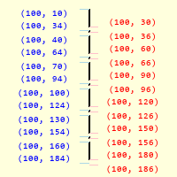

=======================
Different Line Patterns
=======================

The method of selecting the dash configuration was based on table 10 in the 
Canvas Line options `"Tkinter 8.5 reference a GUI for Python" 
<https://www.hsg-kl.de/faecher/inf/python/tkinter/tkinter.pdf>`_. Here a
single entry in the tuple produces alternate dashes and spaces of equal 
length, whereas a larger number of entries specify the dash and space 
pattern. For instance ::

    dash = (3, 5)

.. sidebar:: Dealing the Dash Tuple

    When retrieving the entries from the dash tuple expand the tuple into
    two arguments whose second argument is a starred variable::
    
        >>> dash = (7,1,1,1)
        ....
        >>> dash0, *dash = dash
        >>> print(dash0)
        7
        >>> print(dash)
        (1,1,1)
    
    Use this method to know the current entry of the tuple which shows
    the current dash or space size.

would produce a 3-pixel dash followed by 5-pixel of space, this pattern is 
repeated for the line length, whereas (7, 1, 1, 1) creates a 7-pixel dash 
followed by a space then a dot and finishes with a space. Finally dash = (5,)
would show as 5-pixel dash followed by a 5-pixel space.

.. note:: The dash tuple should be either a single entry, or an even number 
    of  entries.

Changes to Script
-----------------

 .. figure:: ../figures/dashes/start_end_array(15,15).png
    :width: 600
    :height: 600
    :align: center

    Making a Dash and Gap (15, 15)
    
    Blue values on left are start array, red values on right are end array.
    Size of pattern is 30 pixels, each array has 30 pixel steps. First dash
    between (100,10) and (100,24), first gap between (100,24) and (100,40), 
    this pattern is repeated.
    
The examples upto now dealt with a two entry tuple, The first 
linspace gives us the coordinates of the starts of the first dash, for the 
number of times the pattern is repeated. Similarly the second linspace gives 
the endings of the dash, creating values in synch with the start array, after 
that there is a gap to the start of the next pattern. 

At the start of the function the dash entries were extracted. There is no set 
pattern but we can determine its length, as it is difficult to allocate 
variables beforehand, determine the value of the current dash or gap, which 
always come alternately.

    Making a Dash and Gap (21,3,3,3)
    
    Blue values on left are the start array, red values on right are end the
    array. Size of pattern is 30 pixels, each array has 30 pixel steps. First 
    a dash between (100,10) and (100,30), the first gap between (100,30) and 
    (100,34), then a dash between (100,34) and (100,36), finally a gap
    between (100,36) and (100,40), this pattern is repeated.

.. note:: Compare the two figures, as the sum of the dashes and gaps is
    the same for both patterns ((15,15) and (21,3,3,3)) the steps within the
    arrays are the same. Further both lines start and finish at the same
    points, so the start array for (15,15) is the same value for (21,3,3,3)
    in its first start array.

Look at the existing function script, the only adjustment was the dash 
length minus one was used at the start of the end array
and the length of the dash gap combination. Add the dash 
tuple extraction to the current script and put in a while loop for the 
linspace and concatenation functions, then run with a two entry dash tuple::

    if len(dash) == 1 :
        dash = dash + dash
    ....
    dash0, *dash = dash
    dash2 = dash0 - 1
    ....
    while len(dash) > 0:
        ....
        dash0, *dash = dash
        dash2 = dash0 - 1

Having seen what happens with 
a two entry 
dash tuple, try it with a four entry dash (21,3,3,3). Not all the dashes show
because there are two passes of the while loop. Only arrays of the same 
dimension can be concatenated, so on the first pass create
``all_arr`` from the start and end arrays,
on the next pass join the previous result to the newly 
formed arrays::

    if all_arr is None:
            all_arr = concatenate([start_arr, end_arr], axis=0)
        else:
            all_arr = concatenate([start_arr, end_arr, all_arr], axis=0)

As explained before, the very first start array works with the overall size 
of the dash tuple, so put any adjustments to the next start array
at the end of the while loop::

    dash0, *dash = dash
    dash_plus = dash0 + 1

    x0 = x0 + int_up(dash_plus * cos(theta))
    y0 = y0 + int_up(dash_plus * sin(theta))
    x1 = x1 + int_up(dash_plus * cos(theta))
    y1 = y1 + int_up(dash_plus * sin(theta))

Use dash_plus instead of dash2 to highlight the difference.
The adjustments to the dash endings are changed from dash2 to dash_minus for 
consistency.

.. container:: toggle

    .. container:: header

        *Show/Hide Code* 08dash_gap_function.py

    .. literalinclude:: ../examples/dashes/08dash_gap_function.py
