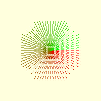
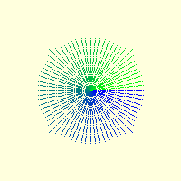

====================
Revisit Line Lengths
====================

As the line patterns become longer some dashes will be drawn after the end
coordinates, we want the pattern to end at or just short of the end position 
with part of the pattern of dashes and gaps at the finish.

The dashes and gaps should be constant in pixel number even when the 
line length is not an exact multiple of the dash pattern. Limit the 
arrays so that coordinates that are beyond the end position are deleted, 
then it is feasible to fit the pattern as optimally as possible.

Within the main while loop each linspace is followed by a short while loop
that deletes the last row of the array if that row is too far from the start
position::

    while(dist(start_pos,start_arr[-1,:]) > size):
        start_arr = delete (start_arr, (-1), axis=0)

and the end array::

    while(dist(start_pos,end_arr[-1,:]) > size):
            end_arr = delete (end_arr, (-1), axis=0)

..

.. sidebar:: int_up

    This is a small utility function that rounds positive numbers up and 
    negative numbers down if they are more than integer plus 0.5, otherwise
    positive numbers are rounded down and negative numbers up. This works 
    differently to int::
    
        def int_up(x):
            return int(x + 0.5) if x >= 0 else int(x - 0.5)

The previous script shortened the line, we can afford to stretch the line
to accommodate inclined situations. First determine the size of the line and
then the longest x or y ordinates::

    size = dist(start_pos, end_pos)
    ....
    length = abs(x1 - x0) if abs(x1 - x0) >= abs(y1 - y0) else abs(y1 - y0)
    
    if length % dash_gap_length != 0:
        factor = length//dash_gap_length
        length = factor * dash_gap_length
        if abs(x1 - x0) >= abs(y1 - y0):
            x1 = x0 + fx * length
            y1 = int_up(y0 + fy * length * abs(tan(theta)))
        else:
            y1 = y0 + fy * length
            x1 = int_up(x0 + fx * length * abs(tan(phi)))
    ....
    
        # make second part of the line array
        if abs(x1 - x0) >= abs(y1 - y0):
            x0 = x0 + fx * dash_minus
            y0 = y0 + fy * int_up(dash_minus * abs(tan(theta)))
            x1 = x1 + fx * dash_minus
            y1 = y1 + fy * int_up(dash_minus * abs(tan(theta)))
        else:
            x0 = x0 + fx * int_up(dash_minus * abs(tan(phi)))
            y0 = y0 + fy * dash_minus
            x1 = x1 + fx * int_up(dash_minus * abs(tan(phi)))
            y1 = y1 + fy * dash_minus

This also shortens the line, but keeps the longest of the x or y lengths,
determine whether the change in length is added or subtracted.
Likewise the changes in lengths are made using abs(tan(theta)) or 
abs(tan(phi)) where ``phi`` is the complementary angle to ``theta``. It was 
found that as the final array was sorted the start position switched from 
first to last if the angle of the line was greater than 180°. If there was 
an equal number of rows in the array this was of no consequence, but if there
was an odd number of rows in the array the first position is overlooked 
and a wrong pattern drawn. If the final array is inverted when the line 
angle is more than 180° then this problem is solved::

    fact = -1 if abs(theta) >= pi else 1
    ....
    # sort along the column, where the maximum change occurs
    if abs(x1 -x0) > abs(y1 -y0):
        fin_arr = int_(all_arr[all_arr[:, 0].argsort()])
        fin_arr = fin_arr[::-1] if fact == -1 else fin_arr
    else:
        fin_arr = int_(all_arr[all_arr[:, 1].argsort()])
        fin_arr = fin_arr[::-1] if fact == -1 else fin_arr

    
    Using tan to adjust lengths
    
    Although the 45° lines are shorter, they are actually true

All the lines were drawn radially, hence the different colours. The pattern 
was (7,1,1,1) and looks good at the main axes.

.. container:: toggle

    .. container:: header

        *Show/Hide Code* 10angled_dash_gap.py

    .. literalinclude:: ../examples/dashes/10angled_dash_gap.py

An alternative function was made, based on sine and cosine. The advantage 
here was that no adjustment for sign was necessary, so this simplified the 
task::

    # make second part of the line array
    if angle not in (45, 135, 225, 315):
        x0 = x0 + int_up(dash_minus * cos(theta))
        y0 = y0 + int_up(dash_minus * sin(theta))
        x1 = x1 + int_up(dash_minus * cos(theta))
        y1 = y1 + int_up(dash_minus * sin(theta))
    else:
        x0 = x0 + dash_minus * int_up(cos(theta))
        y0 = y0 + dash_minus * int_up(sin(theta))
        x1 = x1 + dash_minus * int_up(cos(theta))
        y1 = y1 + dash_minus * int_up(sin(theta))

But all was not plain sailing.
Later on rather than invert the array the drawing was started one line later
if the line angle was greater than 180° and there was an odd number of rows
in the array::

    if fact == -1:
        start_draw = 0 if len(fin_arr)%2 == 0 else 1
    else:
        start_draw = 0
    
    [draw.line([tuple(fin_arr[n]), tuple(fin_arr[n+1])], width=1, fill=fill)
            for n in range(start_draw, nr_lines, 2)]

.. _sin-cos:

    
    Using sin and cos to adjust lengths
    
    Apart from the 45° lines, the other lines look to be the same size

This script was saved in the dimension tools due to its simplicity.

.. container:: toggle

    .. container:: header

        *Show/Hide Code* 11angled_dash_gap_sin_cos.py

    .. literalinclude:: ../examples/dashes/11angled_dash_gap_sin_cos.py