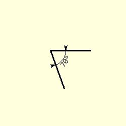
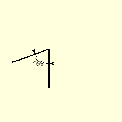
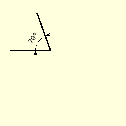
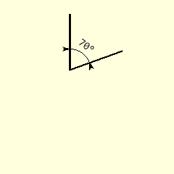
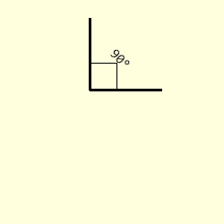

===============
Angle Dimension
===============

,,

    +--------------+---------------+--------------+---------------+-----------------+
    |                      **Normal Angles**                      | **Right Angle** |
    +==============+===============+==============+===============+=================+
    |   |0_70|     |   |90_70|     |  |180_70|    |  |270_70|     |    |270_90|     |
    +--------------+---------------+--------------+---------------+-----------------+
    | First Sector | Second Sector | Third Sector | Fourth Sector |  Fourth Sector  |
    +--------------+---------------+--------------+---------------+-----------------+

Angle Dimension Properties 
--------------------------

.. raw:: html

   

   
<a>Show/Hide <b>Angle Dimension</b> Attributes</a>

PIL has a separate arc method with the following properties.

# xy
    Four points to define the bounding box. Sequence of [(x0, y0), (x1, y1)] 
    or [x0, y0, x1, y1].
# start
    Starting angle, in degrees
# end   
    Ending angle, in degrees.
# fill
    Arc colour

Angled dimension is similar to the arc with some changes

# im 
    PIL image handle, link to the calling program
# centre
    Arc's circle centre
# radius
    Arc's circle radius
# begin
    Starting angle, in degrees
# end   
    Ending angle, in degrees.
# fill
    Arc colour    
# text
    Text to be written next to the dimension
# font
    Font of the text
# arrowhead
    Three integer tuple describing the shape and size of the arrow

.. raw:: html

   

Create Angled Dimension
-----------------------

The arcs used for dimensions are based on circles rather than ellipses, so
use the arc centre, its radius and the start and end angles, rather than the
box surrounding the circle containing the arc::

    def create_arc(draw,centre,radius,start,end,fill='black'):
        # create arc with centre and radius
        return draw.arc([centre[0]-radius,centre[1]-radius,centre[0]+radius,
                        centre[1]+radius], start=start, end=end, fill=fill)

Another useful utility function is the conversion from polar to cartesian
coordinates::

    def polar2cart(centre, phi, ray, units='degrees'):
    # convert polar to cartesian coordinates
    if units == 'degrees':
        phi = radians(phi)
    elif units == 'radians':
        pass
    else:
        raise Exception('polar2cart: units {} can only be "degrees" or "radians"'\
            .format(units))
    
    dx = ray * cos(phi)
    dy = ray * sin(phi)
    x = centre[0] + dx
    y = centre[1] + dy

    return int_up(x), int_up(y)

.. _p2c:

The arc dimension shows the angle directly, so no extension lines are required, 
add the text straightaway. Use the PIL image reference, centre, radius,
begin and end angles, followed by the text and its font
and finally the arrow shape. The attribute **arrow** is not used as the 
selection is made automatically.

Once we have extracted the values from the tuples,  
calculate the coordinates of the begin and end positions. Check whether the
arrows need to be inward or outward pointing (depends on the arc size).
Lastly position the text according to the text and arc sizes.

Add a conditional statement to draw a right angle 
square lines for 90° instead of an arc. If 
the angle becomes a straight line raise an error.

.. container:: toggle

    .. container:: header

        *Show/Hide Code* test_angle_dim.py

    .. literalinclude:: ../examples/dims/test_angle_dim.py