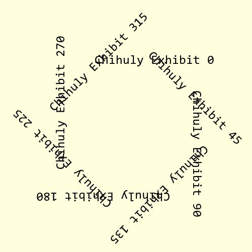
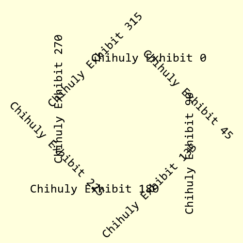

===========
Angled Text
===========

    
    Angled Text for all angles

    The text is advances in an anticlockwise direction when it is rotated. 

Angled Text Properties
----------------------

Pil has no built-in option to create text at an angle, however it does have 
other modules that can produce the desired effect. The method is based on
that provided by stenci
`angled text  <https://stackoverflow.com/questions/245447/how-do-i-draw-text-at-an-angle-using-pythons-pil>`_

.. raw:: html

   

   
<a>Show/Hide <b>Angled Text</b> Attributes</a>

PIL text has the following properties

# xy
    Top left text corner
# text
    Text to be written, if it contains a newline, then it is passed onto 
    multiline_text
# fill
    Text colour
# font
    ImageFont instance
# anchor
    Specify alternate anchor points, used on TTF fonts.

The angled text has the following additions and changes.

# im
    PIL image handle, link to the calling program
# at
    anchor to text middle
# angle
    text angle in degrees
# aall
    integer showing whether to have all angles, default all angles 1

.. raw:: html

   

    
Create Angled Text
------------------

    
    Constrained Angled Text 

    The text angle is restricted so that no angle produces upside down writing.

Make a function that can produce the rotated text, in essence 
an image of the text is created and rotated, then is pasted back into the 
parent image. The text image is created with an
RGBA attribute set to transparent, the parent image does not need 
an RGBA attribute, RGB will suffice. This way a dark surround of the angled 
text is avoided. Remember image rotation is reckoned anticlockwise. 

When the text is rotated set the ``expand`` attribute on, also set the 
resample filter to BICUBIC (LANCZOS does not work with rotate). The 
rotated text is 
pasted directly into the parent image at coordinates given. During
rotation the box surrounding the image changes size, so determine its new 
size before pasting. The text image is used as its own mask for pasting. 

When 
determining how the text sits in the parent image remember that in PIL the 
upper left corner of the text is used to position it. At different angles the
relative position of the upper left corner and the position of the text 
placement shifts, according to the sector and angle. In tkinter the text uses 
its centre as the anchor point when 
positioned in the parent image. This latter method simplifies text 
positioning and
will be used for our angled text. The necessary adjustment is not too
onerous.

.. container:: toggle

    .. container:: header

        *Show/Hide Code* test_angled_text.py

    .. literalinclude:: ../examples/dims/test_angled_text.py
 

.. todo:: Multiline angled text is not yet sorted out

