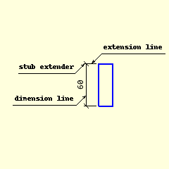

===============
Extension Lines
===============

With some dimensions, such as inner, start and end on the vessel wall, it is
obvious what they are measuring, but there other dimensions drawn outside
of the vessel where the actual measuring point has to be explicitly shown.
Use extension lines to aid the user. Generally these are perpendicular to
both the object (vessel wall) and the dimension line.

      
      Extension lines to outer dimension
      
      Extension lines do not touch object, but pass through dimension

Using an outer vertical dimension as an example, the vessel wall is shown as 
a thick
blue line running vertically. The dimension, also vertical, will show the 
length of the
vessel, and lie to the left of the vessel wall. The extenders 
will lie horizontal and show to which points on the wall the dimension is 
referring.

The extender almost touches the vessel wall, but intersects the dimension 
and extends slightly past it.

On a dimension that is always vertical or horizontal one could calculate the
dimension and extender positions using two dictionaries with the sine and
cosine values of the relevant horizontal and vertical angles::

   sin0 = {-180: 0, -90: -1, 0: 0, 90: 1, 180: 0, 270: -1, 360: 0}
   cos0 = {-180: -1, -90: 0, 0: 1, 90: 0, 180: -1, 270: 0, 360: 1}

then calculate the next position with something like this::

   ptC = ptA[0] + abs(extaO) * cos0[angle-90], ptA[1] + abs(extaO) * sin0[angle-90]
   
One could equally have used the sine and cosine values directly::

   ptC = ptA[0] + abs(extaO) * cos(angle-90), ptA[1] + abs(extaO) * sin(angle-90)

The problem is that the values are real numbers and some parts of the program 
require 
integers. When using the dictionaries this problem falls away.

In the end the function polar2cart was used, since the splitting
of the points into x and y coordinates, and providing integers for the result
was already taken care of::

   ptC = polar2cart(ptA, angle-90, abs(extaO))