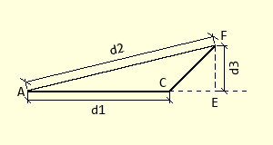

==============
PIL Dimensions
==============

Any sketch or drawing is normally to scale and
has a few important dimensions such as overall sizes, working levels, 
thicknesses and special angles. An interactive 
sketch would suit tkinter, whereas PIL can easily make a hard copy.

The tkinter Canvas line has more options than PIL, see table 10 
Canvas line options in `"Tkinter 8.5 reference a GUI for Python" 
<https://anzeljg.github.io/rin2/book2/2405/docs/tkinter/tkinter.pdf>`_. 

Let's add some of these options to PIL, with a bit extra.

The running order is so that the properties are built up accumatively, so
the inner dimension only requires the base dimension and angled text. Use
normal PIL lines, polygons and arcs to build the dimension components.

.. toctree::
   :caption: PIL Dimensions...
   :maxdepth: 1
   
   intro_dims
   line_dim
   change_line_dim
   angle_text
   inner_dim
   thick_dim
   angle_dim
   extenders
   outer_dim
   slanted_dim
   level_dim
   leader