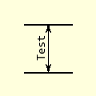
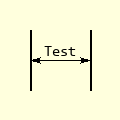

===============
Inner Dimension
===============

..

    +------------+----------+
    |  **Inner Dimensions** |     
    +============+==========+
    |   |hor|    |  |vert|  |
    +------------+----------+
    | Horizontal | Vertical |
    +------------+----------+

Inner Dimension Properties
--------------------------

This dimension uses the line dimension and angled text, but only works in an
orthogonal manner.

.. raw:: html

   

   
<a>Show/Hide <b>Inner Dimension</b> Attributes</a>

* im 
    PIL image handle, link to the calling program
* dr
    PIL drawing handle, link to the calling program
* ptA
    Start coordinates
* ptB 
    Finishing coordinates 
* text
    Text to be written next to the dimension, default None
* font
    Font of the text, default None
* fill
    Line colour RGB tuple, default (0,0,0)
* width
    Line width in pixels, default 1
* arrowhead
    Three integer tuple describing the shape and size of the arrow, 
    default (8,10,3)
* arrow
    position of the arrow on the line, which influences the direction it 
    points, default "both".

.. raw:: html

   

|

Normally inner dimensions are not slanted. The position of the 
text changes according to orientation, so angled_text is used. 

.. container:: toggle

    .. container:: header

        *Show/Hide Code* test_inner_dim.py

    .. literalinclude:: ../examples/dims/test_inner_dim.py
