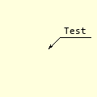
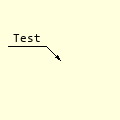
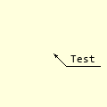
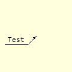

=======
Leaders
=======

.. _props-leader:

Leader Properties
-----------------

.. raw:: html

   

   
<a>Show/Hide <b>Leader</b> Attributes</a>

# im 
    PIL image handle, link to the calling program
# at
    Coordinates on object
# angle
    Angle of first extension line, changes leader orientation
# extA
    Length inclined extension line, default 20
# extB
    Length horizontal extension line, default 20
# text
    Dimension text
# font
    Font of the text
# fill
    Line colour
# width
    Line width in pixels 
# arrowhead
    Three integer tuple describing the shape and size of the arrow
# arrow
    position of the arrow on the line, which influences the direction it 
    points.     

.. raw:: html

   

|

..

    +----------------+-----------------+-----------------+-----------------+
    |        **Upper Leader**          |         **Lower Leader**          |
    +================+=================+=================+=================+
    |   |l225|       |    |l315|       |    |l135|       |     |l45|       |
    +----------------+-----------------+-----------------+-----------------+
    | Left position  | Right position  |  Left position  | Right position  |
    |     225°       |      315°       |       135°      |       45°       |
    +----------------+-----------------+-----------------+-----------------+

Leaders allow us to refer to a specific item property not easily shown by 
normal dimensions or general decriptive notes.

The leader example has a single arrow on an angled line with a horizontal
line over which the text is placed.

Changing the angle gives different leader orientations. It is better to
use angles between 30 and 60° in each of the quadrants.

.. container:: toggle

    .. container:: header

        *Show/Hide Code* test_leader.py

    .. literalinclude:: ../examples/dims/test_leader.py