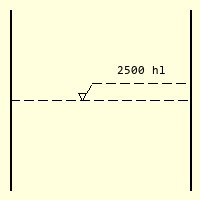
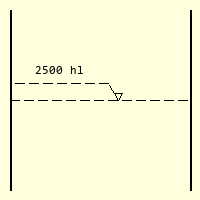
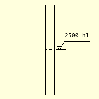
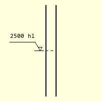

================
Level Dimensions
================

.. _props-level:

Level Properties
----------------

.. raw:: html

   

   
<a>Show/Hide <b>Level Dimension</b> Attributes</a>

* im 
    PIL image handle, link to the calling program
* dr
    PIL drawing handle, link to the calling program
* at
    Coordinates at left tank wall level
* diam    
    Tank diameter, pixels
* ldrA
    Inclined leader length, default 20
* ldrB
    Horizontal leader length, default 20
* ext
    Tuple of length external extender and gap, if an integer then the 
    extender touches the vessel wall, unless it is 0 then the dimension
    becomes internal, default 0
* dash    
    Tuple giving dash pattern, dash length then gap default (10, 4)
* text
    Dimension text, default None
* font
    Font of the text, default None
* fill
    Dimension colour RGB tuple, default (0,0,0)
* tri
    Level indicator, equilateral triangle default 8

.. raw:: html

   

|

    
    Level dimension inside a tank

    
    Level dimension negative leader

Contents of a tank are shown with dashed line and dashed leaders. The dashed 
lines are made using a dashed line created from a function created in the
next section, although the plain Bresenham/Zigl algorithm can be used. Apart
from
the starting position, diameter of tank, the user can choose different dash
patterns, the inclined leader length and the indicating triangle size. The
dimension lies on the righthand side of the vessel, if a
negative value ``ldrA`` is used the dimension is on the lefthand side.

If the normal level dimension cannot be used then an outside dimension can
be used. This has an extension line outside of the vessel, the indicating 
triangle sits on the extension line. As the leaders are outside of the vessel
they are drawn solidly. The extender ``ext`` can be a single integer, in 
which case the line touches
the vessel or as a tuple of two values, the first being the line length, the
second the gap length.

    
    Level dimension outside a tank

    
    Outside level dimension negative leader

.. container:: toggle

    .. container:: header

        *Show/Hide Code* level_dim.py

    .. literalinclude:: ../examples/dims/level_dim.py

