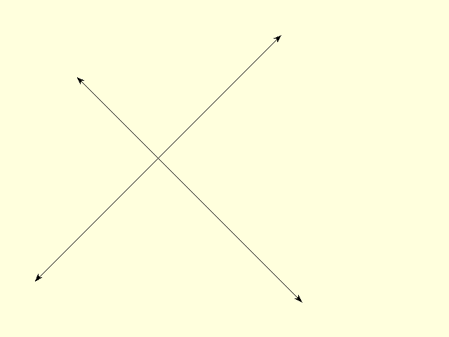
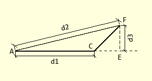

==============
Line Dimension
==============

    
    Line Dimension with Arrows at Both Ends 

The first function ``dimension`` is used to draw a line with arrows at one or
both ends. Use the two attributes ``arrow`` and ``arrowshape`` to 
define the arrow(s), just like tkinter.

Dimension Properties
--------------------

.. raw:: html

   

   
<a>Show/Hide <b>Line Dimension</b> Attributes</a>

PIL line has 3 documented attributes

* xy
    Sequence of 2 tuples like  [(x, y), (x, y), ...] or numeric values like 
    [x, y, x, y, ...].
* fill
    Line colour
* width
    Line width in pixels

Dimension is similar to line, with the following changes

* dr 
    PIL drawing handle, link to the calling program
* ptA
    Start coordinates
* ptB
    Finish coordinates
* arrowhead
    Three integer tuple describing the shape and size of the arrow,
    default (8, 10, 3)
* arrow
    position of the arrow on the line, which influences the direction it 
    points, default 'last'.
* fill
    Colour as RGB tuple, default (0,0,0)

.. raw:: html

   

|

Arrow and Arrowshape Attributes
-------------------------------

    Arrowshape, showing the tuple variables (d1, d2, d3)
    
    Point A is the arrow point, C is the length down the shaft covered by the 
    arrow, F is one of the trailing tips and E is on the shaft at the
    perpendicular from the trailing tip F.

**arrowshape** is a tuple
of three figures, the first d1 shows the length down the line covered by the 
arrow (AC), the second d2 is the length between the point and trailing tips
(AF) and lastly the perpendicular distance d3 between the shaft and the 
trailing tips (EF). The default value (8, 10, 3) is not a right angled 
triangle but produces a shape like that of a swift's tail. 

**arrow** has three options "first", "last" and "both" which
positions the arrow relative to the line ends. 

Create Dimension Script
-----------------------

Start with the vertical orientation, as the geometry is easier. Call up the
dimension function with three attributes, the PIL drawing reference and the 
start and end points, other attributes will be default values. After 
unpacking the tuples check that the line is 
vertical, the first arrow will point up the page on top of the line::

    from PIL import Image, ImageDraw
    from math import atan2, sin, cos, radians, sqrt
    
    def dimension(dr, ptA, ptB, width=1, color=(0,0,0), 
                arrowhead=(8, 10, 3), arrow='first'):
        # extract dims from tuples
        x0, y0 = ptA
        x1, y1 = ptB
        phi = atan2(y1-y0, x1-x0)
        d1, d2, d3 = arrowhead

    if __name__ == "__main__":
        w, h = 200, 200
        image = Image.new('RGB', (w,h), 'white')
        draw = ImageDraw.Draw(image)
        ptA = (50,50)
        ptB = (150,50)
        dimension(draw, ptA, ptB)
        image.show()

The variable ``image`` is the PIL image variable used in the main() part::

    image = Image.new('RGBA', (w,h), 'white')

Because the line is vertical x-coordinates of the points lying on the shaft
will be the same. This applies to the arrow tip (a), the point (c) where the 
arrow lies along 
the shaft, and the point (e) where the perpendicular from the trailing edge
meets the shaft. This perpendicular is fixed on the y-coordinate by a simple
square root of the long side (d2) squared minus the perpendicular distance 
(d3) squared. The two trailing tips also have the same y-coordinates. The 
trailing tips are an x-distance d3 either side of the shaft.

The arrow can now be drawn as a polygon, PIL automatically closes the figure::

    ...
    # Check if line is vertical
    if x0==x1:
        if arrow in ('first', 'both'):
            cx = ex = x0 # shaft part, perpendicular, ptA all same x-values
            cy = y0 + d1 # length shaft part
            # same y-values for perpendicular and trailing tips
            ey = fy = gy = y0 + int(sqrt(d2 * d2 - d3 * d3) + 0.5)
            # x-values trailing tips
            fx = x0 + d3
            gx = x0 - d3
            dr.polygon([(x0, y0), (fx, fy), (cx, cy),
                        (gx, gy)], fill=color)

The result compares favourably with the tkinter line and arrow. There needs 
to be another arrow pointing in the opposite direction for the **last** and
**both** arrow instances. Once completed test that the correct arrow shows
when selected and both arrows show when called. With that 
completed make the horizontal arrows.

As it stands if ptA is below ptB the arrows face inwards, for the
moment ignore this and make a line at a slant. Unlike the
vertical and horizontal arrows slanting arrows normally have no other 
construction point with the same
x- and y-values. Otherwise the principle
is as before, start with the arrow tip, find the distance along the shaft in
x and y, find the position of the perpendicular to the trailing tips, and 
finally fix the trailing tips. We can make the perpendicular distance between
the shaft and arrow tip common to both arrows. Now create a polygon::

    # perpendicular distance shaft to arrow tip
    el = int_up(sqrt(d2 * d2 - d3 * d3)) 
    ...
    else:
        phi = atan2(y1 - y0, x1 - x0)
        if arrow in ('first', 'both'):
            cx = x0 + d1 * cos(phi)
            cy = y0 + d1 * sin(phi)
            ex = x0 + el * cos(phi)
            ey = y0 + el * sin(phi)
            fx = ex + d3 * sin(phi)
            fy = ey - d3 * cos(phi)
            gx = ex - d3 * sin(phi)
            gy = ey + d3 * cos(phi)
            dr.polygon([(x0, y0), (fx, fy), (cx, cy),
                        (gx, gy)], fill=color)

A similar set of equations is used for the opposite arrow. Test these arrows
and try running the lines using the slanting equations only without the 
vertical and horizontal options. The results should be better in that the 
arrows point outwards no matter where the start and finish lie. Remove the
vertical and horizontal orientations, instead of 
six options with a tricky conditional situation, there are just two options
- far better.

