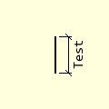
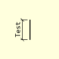
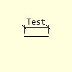
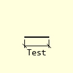

================
Outer Dimensions
================

,,

    +----------------+-----------------+-----------------+-----------------+
    |   **Vertical Dimension**         |      **Horizontal Dimension**     |
    +================+=================+=================+=================+
    |  |lefto|       |  |righto|       |  |aboveo|       |  |belowo|       |
    +----------------+-----------------+-----------------+-----------------+
    | Left position  | Right position  | Upper position  | Lower position  |
    +----------------+-----------------+-----------------+-----------------+
    | Negative 270°  |  Positive 90°   |  Positive 0°    |  Negative 180°  |
    +----------------+-----------------+-----------------+-----------------+

Outer Dimension Properties
--------------------------

.. raw:: html

   

   
<a>Show/Hide <b>Outer Dimension</b> Attributes</a>

# im 
    PIL image handle, link to the calling program
# dr
    PIL drawing handle, link to the calling program
# ptA
    Start coordinates
# ptB 
    Finishing coordinates
# extA
    Two integer tuple, giving the extension line size and gap next to start
# extB
    Two integer tuple, giving the extension line size and gap next to end,
    optional if the same as extA
# text
    Dimension text, default None
# font
    Font of the text
# textorient
    Change text orientation, "h", "horizontal", "v", "vertical" 
# fill
    Line colour RGB tuple, default (0,0,0)
# width
    Line width in pixels, default 1  
# tail
    Show tails or arrows, default **True**
# arrowhead
    Three integer tuple describing the shape and size of the arrow,
    default (8,10,3)
# arrow
    position of the arrow on the line, which influences the direction it 
    points, default "both".

.. raw:: html

   

|

Dimensions taken to the outside of an item will have extension lines and 
text, often there are several dimensions chained one to another plus one 
overall dimension positioned outside of the chained dimensions. If the chained
dimensions have arrows the effect can be rather cluttered, and if they have 
short tails the effect can look better. Which method to use is a matter of 
taste or what is considered standard. 

These dimensions are vertical or horizontal, for slanting dimensions see the
next section. The text on vertical dimensions runs vertically, 
whilst horizontal dimensions have horizontal text. If the default text 
orientation needs changing use **textorient**
to change its orientation (horizontal or vertical).

It is assumed that the 
dimensions lie to the right of the item or above it, when using dimensions to
the left of an item or below the item use negative extension sizes. When
both extension lines are the same the second extender **extB** can be left 
without a value.
If the object is not linear over the dimension, use different sizes for the 
extensions, **extA** and **extB**. Extension line lengths are given as a 
tuple of two integers, 
the first shows the drawn line length and the next the space between the 
object and drawn line, if no gap is required use a single integer. 

.. note:: The start, ``ptA``, and end, ``ptB``, points refer to the 
    dimension itself, so the object lies the length of the extender away 
    from ptA and ptB.

Confirm that we are dealing with vertical or horizontal dimensions.
Several positioning properties depend on the orientation, so the extension 
lines are horizontal on vertical dimensions and vertical on the horizontal 
dimensions. Then 
either add the two 45" stubs 
or add arrows to the dimension line , finally the angled text is added.

At the end you should have something like the following.

.. container:: toggle

    .. container:: header

        *Show/Hide Code* test_dims.py

    .. literalinclude:: ../examples/dims/test_dims.py
