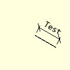
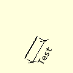
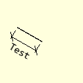
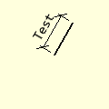

==================
Slanting Dimension
==================

..

    
    +----------------+-----------------+-----------------+-----------------+
    |                       **Slanting Dimensions**                        |
    +================+=================+=================+=================+
    |  |30|          |  |120|          |  |210|          |  |300|          |
    +----------------+-----------------+-----------------+-----------------+
    | Sloping at 30° | Sloping at 120° | Sloping at 210° | sloping at 300° |
    +----------------+-----------------+-----------------+-----------------+

Slanting Dimension Properties
-----------------------------

.. raw:: html

   

   
<a>Show/Hide <b>Slanting Dimension</b> Attributes</a>

# im 
    PIL image handle, link to the calling program
# dr
    PIL drawing handle, link to the calling program
# ptA
    Start coordinates
# ptB 
    Finishing coordinates, optional default None
# extA
    Two integer tuple, giving the extension line size and gap next to start
    default (8,3)
# angle
    Slope of dimension, optional default None
# length
    Dimension length, optional default None
# text
    Dimension text, optional default None
# font
    Font of the text, optional default None
# fill
    Line colour RGB tuple, default (0,0,0)
# width
    Line width in pixels, default 1
# arrowhead
    Three integer tuple describing the shape and size of the arrow
# arrow
    position of the arrow on the line, which influences the direction it 
    points.
# tail
    Show tails or arrows, default **True**

.. raw:: html

   

|

This dimension is set parallel to the slanting surface, with extensions  
perpendicular to the dimension and object. The text is set outside of the 
dimension with the text orientation running parallel to the dimension. Use 
either 45° short stubs or arrows, select ``tail`` True for 45° stubs. 
Unlike the outer dimension the start and finishing points are
on the item.

In essence apart from the complication of the angled geometry, it follows 
much the same pattern as the outer dimension. Specify the dimension position 
by giving two coordinates from the object, ptA and ptB, perpendicular distance
of the extension, extA, alternatively give the start position and angle with
dimension length. It is assumed that both extensions are of equal size.

If the text lies on the wrong side add 180° to the angle.

.. container:: toggle

    .. container:: header

        *Show/Hide Code* test_slant_dim.py

    .. literalinclude:: ../examples/dims/test_slant_dim.py

