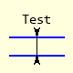
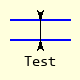
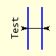
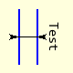

===================
Thickness Dimension
===================

..

    +---------------+-----------------+--------------+---------------+
    |  .. centered:: **Thickness Dimensions**                        |
    +===============+=================+==============+===============+
    |  |left|       |  |right|        |  |above|     |  |below|      |
    +---------------+-----------------+--------------+---------------+
    | horizontal 0° | horizontal 180° | vertical 90° | vertical 270° |
    +---------------+-----------------+--------------+---------------+

Properties Thickness Dimension
------------------------------

The properties are similar to the inner dimension, but angle has now been 
added.

.. raw:: html

   

   
<a>Show/Hide <b>Thickness Dimension</b> Attributes</a>

# im 
    PIL image handle, link to the calling program
# dr
    PIL drawing handle, link to the calling program
# ptA
    Start coordinates
# thick 
    Thickness of item
# angle
    Slope of Dimension, changes text position, default horizontal 0°
# text
    Text to be written next to the dimension, default None 
# font
    Font of the text, default None
# fill
    Line colour RGB tuple, default (0,0,0)
# width
    Line width in pixels, default 1    
# arrowhead
    Three integer tuple describing the shape and size of the arrow,
    default (8,10,3)

.. raw:: html

   

|

The thickness dimension draws a small line between the inner and outer 
surfaces, two inward pointing arrows are added to the ends of the connecting 
line. To generate the arrows, use dimension twice without a connecting line. 
Text is added that 
lies along the outer surface. 

If the distance between the surfaces is large then use the inner 
dimension with outward pointing arrows. 

.. container:: toggle

    .. container:: header

        *Show/Hide Code* test_thick_dim.py

    .. literalinclude:: ../examples/dims/test_thick_dim.py