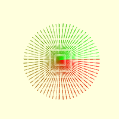
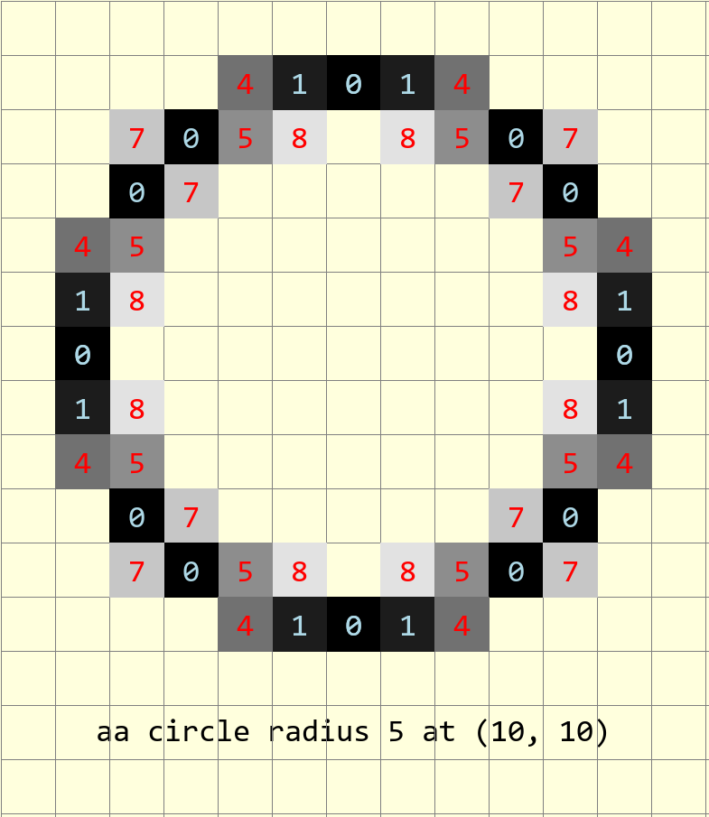

.. _dims:

===================
Dimensioning in PIL
===================

.. topic:: What to Expect

    Add a bit more versatility to an already versatile module, allowing the
    user to dimension drawings, with antialiasing as required and add dashed 
    lines.
    
    For those in a hurry and your python version is newer than 3.7, use the 
    module DimLinesDC which requires a dataclass, otherwise use the module
    DimLinesAA which is very similar. If antialiasing is not necessary use
    the module DimLinesPIL. All modules with annotations are found in the
    **scripts** directory.

Contributors and Navigation
===========================

.. toctree::
   :maxdepth: 3
    
   authors

Dimensions
===========

.. figure:: figures/dims/draw_arrow.png
    :width: 300
    :height: 160
    :align: center

At present PIL has a line drawing ability but no ability to draw lines with
arrows at one or both ends, this together with extension
lines and slanting text are useful utilities. If the drawing is mostly
orthogonal with few sloping lines then this is all you need.

.. toctree::
   :maxdepth: 3
    
   dims/index_dims

Dashed Lines
============

Extend PIL and add dashed lines - another useful component in making drawings.

.. toctree::
   :maxdepth: 3
    
   dashes/index_dashes

Rasterization Lines and Circles
===============================

Lines and circles required rasterization algorithms for screens and printers, 
starting with Bresenham, then using
the rasterizing algorithms from Alois Zigl, gives us the tools for 
antialiasing.

.. toctree::
   :maxdepth: 3
    
   bres/index_rast

Antialiased Dimensions
======================

Using the antialiased rasterised lines, circle and arc a similar set of 
dimensioning aids can be generated to those using just the PIL lines and arcs.
To save repetitious attribute options use a dataclass.

.. toctree::
   :maxdepth: 3
    
   aadims/index_aadims

Sources for Documentation
=========================

.. toctree::
   :maxdepth: 3
    
   source/modules

Indices and tables
==================

* :ref:`genindex`
* :ref:`modindex`
* :ref:`search`
